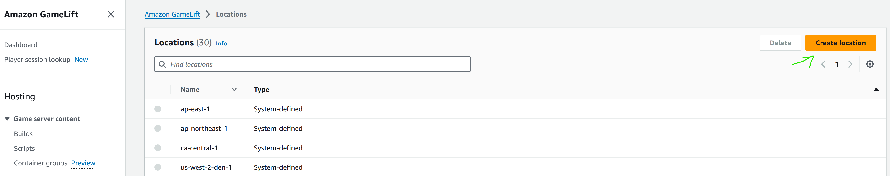
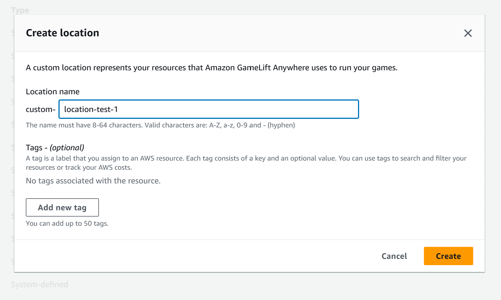
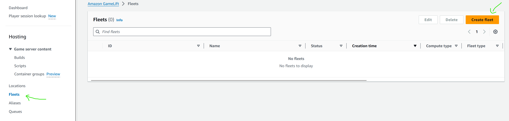
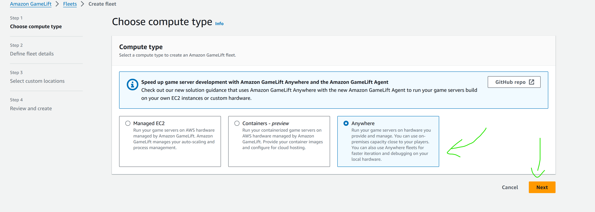
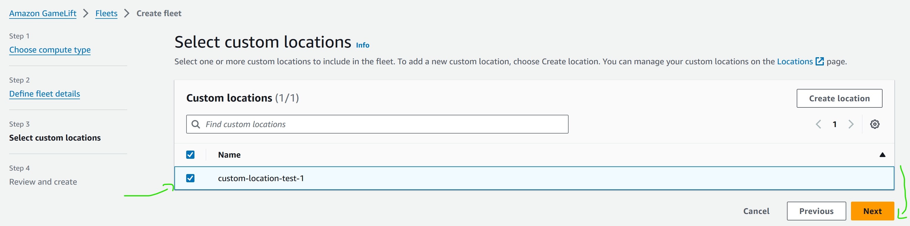
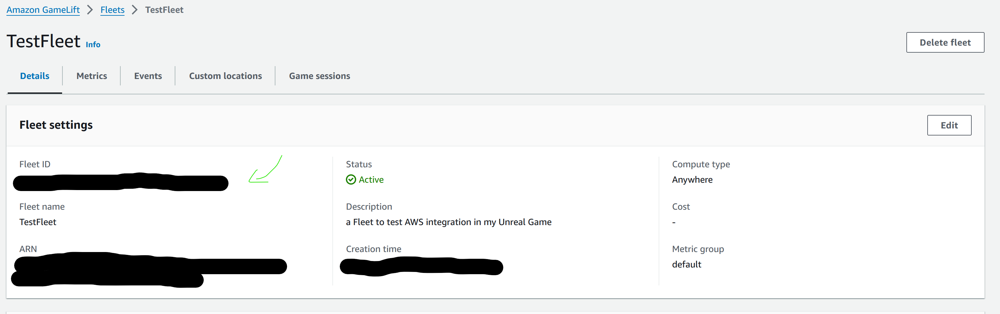

# Exécuter et Tester AWS OSS

Maintenant que vous avez configuré votre propre utilisation du plugin, il est temps de le tester.

Pour tester l'intégration avec Gamelift, nous avons besoin de plusieurs éléments :

- [Exécuter et Tester AWS OSS](#exécuter-et-tester-aws-oss)
  - [Build le serveur de votre jeu](#build-le-serveur-de-votre-jeu)
  - [Configurer un Gamelift Local](#configurer-un-gamelift-local)
    - [Configurer Gamelift Local Legacy](#configurer-gamelift-local-legacy)
    - [Configurer le Nouveau SDK Local Gamelift](#configurer-le-nouveau-sdk-local-gamelift)
  - [Lancer SAM API Gateway](#lancer-sam-api-gateway)

Voyons cela en détail.

## Build le serveur de votre jeu

Il existe de nombreux tutoriels pour faire une build serveur, comme [celui-ci](https://dev.epicgames.com/documentation/en-us/unreal-engine/setting-up-dedicated-servers?application_version=4.27) (en anglais), mais nous avons également une exigence spécifique pour le faire fonctionner avec l'API Gamelift.

En particulier, comme indiqué dans [la documentation AWS](https://docs.aws.amazon.com/gamelift/latest/developerguide/integration-testing.html#integration-testing-dev), nous devons avoir un code spécial dans le Game Instance pour le faire fonctionner.

[Voici](../../../Source/Private/TestAWSGameInstance.cpp#L53) un exemple de ce code.

```cpp
//Obtenir le module en premier.
	FGameLiftServerSDKModule* gameLiftSdkModule = &FModuleManager::LoadModuleChecked<FGameLiftServerSDKModule>(FName("GameLiftServerSDK"));

	//Définir les paramètres du serveur pour une fleet GameLift Anywhere. Ceux-ci ne sont pas nécessaires pour une fleet EC2 gérée par GameLift.
	FServerParameters serverParameters;

	//AuthToken retourné par l'API "aws gamelift get-compute-auth-token". Notez que cela expirera et nécessitera un nouvel appel à l'API après 15 minutes.
	if (FParse::Value(FCommandLine::Get(), TEXT("-authtoken="), serverParameters.m_authToken))
	{
		UE_LOG(GameServerLog, Log, TEXT("AUTH_TOKEN: %s"), *serverParameters.m_authToken)
	}

	//L'Host/compute-name de l'instance GameLift Anywhere.
	if (FParse::Value(FCommandLine::Get(), TEXT("-hostid="), serverParameters.m_hostId))
	{
		UE_LOG(GameServerLog, Log, TEXT("HOST_ID: %s"), *serverParameters.m_hostId)
	}

	//L'ID de la fleet Anywhere.
	if (FParse::Value(FCommandLine::Get(), TEXT("-fleetid="), serverParameters.m_fleetId))
	{
		UE_LOG(GameServerLog, Log, TEXT("FLEET_ID: %s"), *serverParameters.m_fleetId)
	}

	//L'URL WebSocket (GameLiftServiceSdkEndpoint).
	if (FParse::Value(FCommandLine::Get(), TEXT("-websocketurl="), serverParameters.m_webSocketUrl))
	{
		UE_LOG(GameServerLog, Log, TEXT("WEBSOCKET_URL: %s"), *serverParameters.m_webSocketUrl)
	}

	//Le PID du processus en cours d'exécution
	serverParameters.m_processId = FString::Printf(TEXT("%d"), GetCurrentProcessId());
	UE_LOG(GameServerLog, Log, TEXT("PID: %s"), *serverParameters.m_processId);

	//InitSDK établit une connexion locale avec l'agent GameLift pour permettre la communication.
	UE_LOG(GameServerLog, Log, TEXT("Call InitSDK"))

	FGameLiftGenericOutcome outcome = gameLiftSdkModule->InitSDK(serverParameters);

	if (outcome.IsSuccess())
	{
		UE_LOG(GameServerLog, Log, TEXT("Initialisation du serveur GameLift réussie"));
	}
	else
	{
		FGameLiftError error = outcome.GetError();
		UE_LOG(GameServerLog, Log, TEXT("Échec de l'initialisation du serveur GameLift : Erreur %s\n%s"), *error.m_errorName, *error.m_errorMessage);
	}


	//Répondre à la demande d'activation de nouvelle session de jeu. GameLift envoie une demande d'activation
	//au serveur de jeu avec un objet de session de jeu contenant des propriétés de jeu
	//et d'autres paramètres. Une fois que le serveur de jeu est prêt à recevoir des connexions de joueurs,
	//invoquez GameLiftServerAPI.ActivateGameSession()
	auto onGameSession = [=](Aws::GameLift::Server::Model::GameSession gameSession)
	{
		FString gameSessionId = FString(gameSession.GetGameSessionId());
		UE_LOG(GameServerLog, Log, TEXT("Initialisation de GameSession : %s"), *gameSessionId);
		gameLiftSdkModule->ActivateGameSession();
	};

	FProcessParameters* params = new FProcessParameters();
	params->OnStartGameSession.BindLambda(onGameSession);

	//Callback OnProcessTerminate. GameLift invoque ce callback avant de fermer l'instance
	//qui héberge ce serveur de jeu pour lui donner le temps de se fermer proprement. 
	//Dans cet exemple, nous informons simplement GameLift que nous allons effectivement nous fermer.
	params->OnTerminate.BindLambda([=]() 
	{
		UE_LOG(GameServerLog, Log, TEXT("Le processus du serveur de jeu se termine"));
		gameLiftSdkModule->ProcessEnding(); 
	});

	//Callback HealthCheck. GameLift invoque ce callback environ toutes les 60 secondes. Par défaut,
	//l'API GameLift répond automatiquement 'true'. Un jeu peut éventuellement effectuer des vérifications sur
	//les dépendances et signaler l'état en fonction de ces informations. Si aucune réponse n'est reçue
	//dans les 60 secondes, l'état de santé est enregistré comme 'false'.
	//Dans cet exemple, nous sommes toujours en bonne santé !
	params->OnHealthCheck.BindLambda([]() {UE_LOG(GameServerLog, Log, TEXT("Exécution du Health Check")); return true; });

	//Ici, le serveur de jeu informe GameLift sur quel port il écoute les connexions entrantes des joueurs.
	//Dans cet exemple, le port est codé en dur pour simplifier. Étant donné que les jeux actifs
	//qui sont sur la même instance doivent avoir des ports uniques, vous pouvez vouloir attribuer des valeurs de port à partir d'une plage.
	const int32 port = FURL::UrlConfig.DefaultPort;
	params->port = port;

	//Ici, le serveur de jeu informe GameLift quel ensemble de fichiers télécharger lorsque la session de jeu
	//se termine. GameLift télécharge tout ce qui est spécifié ici pour que les développeurs puissent le récupérer plus tard.
	TArray<FString> logfiles;
	logfiles.Add(TEXT("aLogFile.txt"));
	params->logParameters = logfiles;

	//Appel à ProcessReady pour indiquer à GameLift que ce serveur de jeu est prêt à recevoir des sessions de jeu !
	outcome = gameLiftSdkModule->ProcessReady(*params);
	if (outcome.IsSuccess())
	{
		UE_LOG(GameServerLog, Log, TEXT("Initialisation du serveur GameLift réussie"));
	}
	else
	{
		FGameLiftError error = outcome.GetError();
		UE_LOG(GameServerLog, Log, TEXT("Échec de l'initialisation du serveur GameLift : Erreur %s\n%s"), *error.m_errorName, *error.m_errorMessage);
	}
```

Vous pouvez consulter les commentaires et la documentation pour comprendre ce que fait ce code, mais en résumé : cela permet au serveur de jeu (le binaire du serveur) de communiquer avec Gamelift et de s'enregistrer.

Maintenant, vous pouvez créer votre build serveur en créant une server target (comme celle ci-dessous) et en utilisant les fichiers source d'UE.

```cs
// Copyright Epic Games, Inc. All Rights Reserved.

using UnrealBuildTool;
using System.Collections.Generic;

public class TestAWSServerTarget : TargetRules //Changez cette ligne selon le nom de votre projet
{
	public TestAWSServerTarget(TargetInfo Target) : base(Target) //Changez cette ligne selon le nom de votre projet
	{
		Type = TargetType.Server;
		DefaultBuildSettings = BuildSettingsVersion.V2;
		ExtraModuleNames.Add("TestAWS"); //Changez cette ligne selon le nom de votre projet
	}
}
```

Vous pourriez rencontrer des problèmes lors du package du jeu ou du lancement de l'exécutable.
Voici une liste de problèmes et quelques solutions :

- L'outil Automation d'Unreal ne fonctionne pas ou Unreal Build Tool ne démarre pas :

Avez-vous compilé le moteur ? Avez-vous compilé les outils associés ?

- La ligne dans le Game Instance ne compile pas :

Avez-vous ajouté le plugin GameliftServerSDK dans votre .uproject et l'avez-vous activé ? L'avez-vous ajouté dans votre .Build.cs ?

- Le serveur compilé plante et ne fonctionne pas :
  
Les bibliothèques OpenSSL et les bibliothèques Gamelift (bibliothèques dynamiques et statiques) sont-elles présentes dans le serveur empaqueté ?

La commande InitSDK peut échouer pour l'instant, mais cela ne sera plus le cas une fois Gamelift configuré.

## Configurer un Gamelift Local

Il y a deux options pour les tests Gamelift : legacy et le nouveau SDK.
Le code de GameInstance montré était conçu pour le nouveau SDK, mais devrait fonctionner avec le legacy.

Il y a quelques différences dans la configuration entre les deux méthodes :

### Configurer Gamelift Local Legacy

C'est la méthode la plus facile à configurer des deux, car elle est également plus limitée.

La plupart de la méthode est expliquée dans [la documentation d'AWS](https://docs.aws.amazon.com/gamelift/latest/developerguide/integration-testing-local.html).

Vous devrez télécharger Java pour faire fonctionner Gamelift localement.

Ensuite, démarrez la build serveur du jeu, vous n'aurez pas besoin de fournir d'arguments pour exécuter le serveur, il devrait être capable de trouver Gamelift tout seul.

Si InitSDK échoue avec le code GameInstance et sans arguments, remplacez le code par un appel à

```cpp
InitSDK(void);
```

Si vous utilisez le legacy et que vous voyez qu'InitSDK a réussi, votre build serveur et le Gamelift local sont correctement connectés.

### Configurer le Nouveau SDK Local Gamelift

Configurer le Gamelift local du nouveau SDK est beaucoup plus compliqué car il repose sur Gamelift Anywhere, qui utilise les même systèmes qu'une solution en production.
Il nécessite donc le même niveau de travail pour la configuration qu'une solution qui pourrait être en production.

C'est bien expliqué et décrit dans [la documentation d'AWS](https://docs.aws.amazon.com/gamelift/latest/developerguide/integration-testing.html), mais nous allons le parcourir ensemble.

Il utilise [AWS-CLI](https://aws.amazon.com/cli/), donc si vous ne l'avez pas installé auparavant, veuillez le faire au préalable.

Tout d'abord, [vous devez créer une location](https://docs.aws.amazon.com/gamelift/latest/developerguide/fleets-creating-anywhere.html#fleet-anywhere-location).
Pour cela, nous utiliserons la Console AWS, dans la section Gamelift.
Assurez-vous d'être dans la bonne région lorsque vous faites cela (car Gamelift Anywhere peut rediriger partout, mais le serveur public qui redirige ne peut être que dans certaines régions)

- Cliquez sur "Create location"



- Donnez un nom à votre location puis cliquez sur "Create"



Vous avez maintenant créé votre location personnalisé.

Ensuite, nous allons [créer une fleet](https://docs.aws.amazon.com/gamelift/latest/developerguide/fleets-creating-anywhere.html#fleet-anywhere-create) associée à l'location.

- Allez sur la page des fleets et cliquez sur "Create"



- Choisissez "Anywhere" puis cliquez sur "Next"



- Donnez un nom à votre fleet puis cliquez sur "Next"


- Choisissez votre nouvelle location créé puis cliquez sur "Next"



- Cliquez sur "Submit" en bas de la page


Vous avez maintenant créé une fleet à laquelle vous pouvez vous connecter.



Nous devons maintenant [enregistrer notre machine locale](https://docs.aws.amazon.com/gamelift/latest/developerguide/fleets-creating-anywhere.html#fleet-anywhere-compute) comme faisant partie de cette fleet.

```sh
aws gamelift register-compute \
    --compute-name TestAWSCompute \
    --fleet-id  fleet-[l'ID de la fleet que vous avez obtenu à l'étape précédente]\
    --ip-address 127.0.0.1 \
    --location custom-location-test-1 
```

Vous aurez besoin de l'ID de la fleet que vous avez créé, que vous pouvez trouver sur la page ci-dessus pour l'associer.

Vous pouvez également, si vous le souhaitez, choisir d'utiliser votre IP publique et faire du port forwarding sur votre Network Adress Translator (NAT) et pare-feu, si vous voulez que ce serveur de test soit accessible depuis le web public.

Maintenant que votre "compute" est enregistré, tout est prêt pour utiliser et exécuter le serveur.

Chaque fois que vous souhaiterez lancer un serveur avec ce nouveau SDK, vous devrez demander un token d'authentification, pour des raisons de sécurité.

La commande ressemble à ceci :

```sh
aws gamelift get-compute-auth-token \
 --fleet-id fleet-[l'ID de la fleet que vous avez obtenu à l'étape précédente]\
 --compute-name TestAWSCompute
```

Vous recevrez un token d'authentification (AuthToken) nécessaire pour exécuter le serveur.

Ensuite, vous pouvez exécuter l'exécutable du serveur, et lui fournir tous les arguments nécessaires pour qu'il initialise correctement InitSDK.

Voici un script bat Windows pour lancer l'exécutable avec les bons arguments.

```bat
set SERVER_EXE_PATH="[Le chemin vers votre exécutable de serveur]"
set FLEET_ID="[L'ID de la fleet que vous avez obtenu précédemment]"
set AUTH_ID="[Le AuthToken de l'étape précédente]"
set HOST_ID="TestAWSCompute"
set WEB_SOCKET="[la location du socket Gamelift ici, il devrait ressembler à ceci : wss://ap-[région choisie].api.amazongamelift.com]"
set PORT="[un port à écouter, à votre convenance, UE le définit à 7777]"

%SERVER_EXE_PATH%\[Nom de votre exécutable de serveur].exe -authtoken=%AUTH_ID% -fleetid=%FLEET_ID% -hostid=%HOST_ID% -websocketurl=%WEB_SOCKET% -port=%PORT% -log
```

Assurez-vous que InitSDK réussit, sinon vous ne pourrez pas tester.

Si cela réussit, vous avez un serveur fonctionnel !

## Lancer SAM API Gateway

Maintenant que nous avons configuré la connexion serveur à Gamelift, nous devons configurer la connexion client à Gamelift.

Pour cela, nous devons lancer AWS-SAM.

Si vous avez déjà configuré votre projet, il n'y a quasimment rien à faire.

Sinon, consultez le [Guide d'installation](../Install/Prerequisites.md).

Tout d'abord, lancez Docker, car SAM l'utilise pour créer un cadre similaire à celui qui se trouve sur le serveur AWS.

Ensuite, lancez AWS-SAM.

J'ai laissé un [script bat](../../../Plugins/AWSOSS/SAM/startapi.bat) pour lancer SAM rapidement. Il ressemble à ceci :

```bat
sam local start-api --container-host-interface 0.0.0.0 --debug
```

Il lance SAM sur local host, en créant des conteneurs sur Docker.

N'oubliez pas de build les Lambdas au préalable avec la commande sam local build.

Une fois correctement lancé, il devrait apparaître en ligne de commande et dans Docker :


Nous avons maintenant la connexion client à Gamelift opérationnelle !

Cela signifie que vous pouvez maintenant tester votre intégration Gamelift !

Amusez-vous bien !
