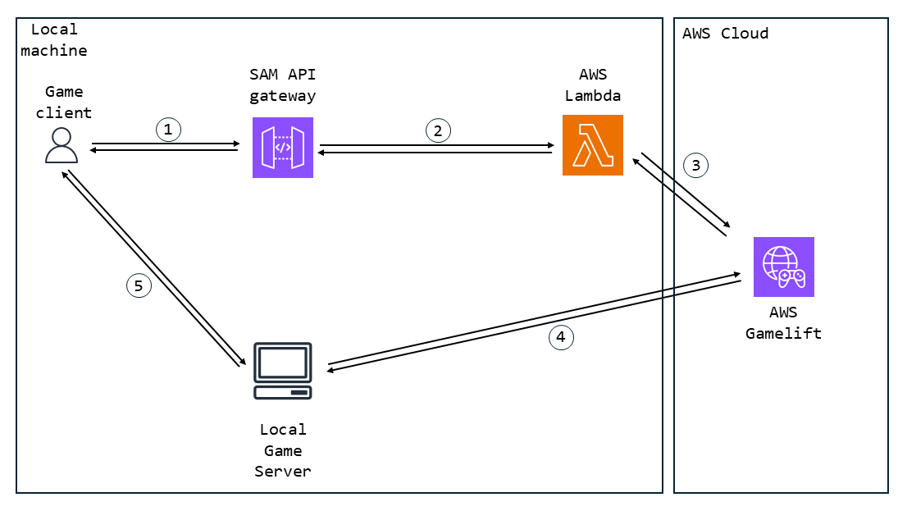
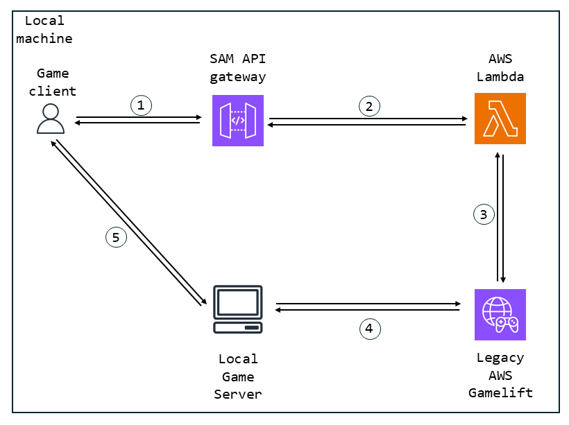

# Créer une Session

Avec le Online Subsystem capable d'envoyer des requêtes HTTP, voyons comment nous pouvons mettre en place un système pour créer une session de jeu distante et s'y connecter.

## Table des matières

- [Créer une Session](#créer-une-session)
  - [Table des matières](#table-des-matières)
  - [Comprendre l'Architecture de la Solution](#comprendre-larchitecture-de-la-solution)
    - [Architecture Gamelift Anywhere](#architecture-gamelift-anywhere)
    - [Architecture Legacy Gamelift](#architecture-legacy-gamelift)
  - [Méthode Create Session](#méthode-create-session)
  - [Méthode Start Session Request](#méthode-start-session-request)
  - [Lambda de Création de Session](#lambda-de-création-de-session)
    - [Création de Session Anywhere SDK](#création-de-session-anywhere-sdk)
    - [Création de Session avec le SDK Legacy](#création-de-session-avec-le-sdk-legacy)
  - [Méthode Start Session Response](#méthode-start-session-response)

## Comprendre l'Architecture de la Solution

Tout d'abord, examinons comment la solution est architecturée pour Gamelift Anywhere et Legacy Local Gamelift (appelé ci-après Legacy).

### Architecture Gamelift Anywhere



1. <picture> <source media="(prefers-color-scheme: dark)" srcset="../../Media/Dark/Res_User_48_Dark.svg"> <source media="(prefers-color-scheme: light)" srcset="../../Media/Light/Res_User_48_Light.svg">  </picture> Le client et  l'API Gateway échangent via des requêtes HTTP entre l'OSS (en utilisant les URL pour pointer vers l'API Gateway de SAM).

2.  L'API Gateway SAM utilise Docker pour initialiser ses  Lambdas et les exécuter.

3.  Les Lambdas accèdent à  AWS Gamelift en utilisant les identifiants dans le AWS CLI.

4.  Gamelift redirige directement vers le serveur local <picture> <source media="(prefers-color-scheme: dark)" srcset="../../Media/Dark/Res_Client_48_Dark.svg"> <source media="(prefers-color-scheme: light)" srcset="../../Media/Light/Res_Client_48_Light.svg">  </picture> grâce à [la configuration de gamelift anywhere en utilisant l'AWS Console et AWS CLI, et avec l'appel réussi de "Gamelift->InitSDK()" du serveur de jeu dans GameInstance](../Usage/Run.md#build-le-serveur-de-votre-jeu).

5. <picture> <source media="(prefers-color-scheme: dark)" srcset="../../Media/Dark/Res_Client_48_Dark.svg"> <source media="(prefers-color-scheme: light)" srcset="../../Media/Light/Res_Client_48_Light.svg">  </picture> Le serveur obtient ensuite une connexion avec le client de la même machine <picture> <source media="(prefers-color-scheme: dark)" srcset="../../Media/Dark/Res_User_48_Dark.svg"> <source media="(prefers-color-scheme: light)" srcset="../../Media/Light/Res_User_48_Light.svg">  </picture> sur un port différent.

L'architecture est donc relativement complexe à mettre en place, mais pas si difficile à faire fonctionner une fois tout configuré.

Nous allons passer en revue :

- [la requête HTTP côté client](#méthode-start-session-request)
- [l'exécution de la lambda](#lambda-de-création-de-session)
- [la connexion entre le client et le serveur](#méthode-start-session-response)

Le reste est automatique à partir de la configuration.

### Architecture Legacy Gamelift



1. <picture> <source media="(prefers-color-scheme: dark)" srcset="../../Media/Dark/Res_User_48_Dark.svg"> <source media="(prefers-color-scheme: light)" srcset="../../Media/Light/Res_User_48_Light.svg">  </picture> Le client et  l'API Gateway échangent via des requêtes HTTP entre l'OSS (en utilisant les URL pour pointer vers l'API Gateway de SAM).

2.  L'API Gateway SAM utilise Docker pour initialiser ses  Lambdas et les exécuter.

3.  Les Lambdas accèdent à  AWS Gamelift en pointant directement vers le port sur la machine où le legacy gamelift est exécuté.

4.  Gamelift redirige directement vers le serveur local <picture> <source media="(prefers-color-scheme: dark)" srcset="../../Media/Dark/Res_Client_48_Dark.svg"> <source media="(prefers-color-scheme: light)" srcset="../../Media/Light/Res_Client_48_Light.svg">  </picture> grâce à [l'appel réussi de "Gamelift->InitSDK()" du serveur de jeu dans GameInstance](../Usage/Run.md#build-your-games-server-build).

5. <picture> <source media="(prefers-color-scheme: dark)" srcset="../Media/Dark/Res_Client_48_Dark.svg"> <source media="(prefers-color-scheme: light)" srcset="../Media/Light/Res_Client_48_Light.svg">  </picture> Le serveur obtient ensuite une connexion avec le client de la même machine <picture> <source media="(prefers-color-scheme: dark)" srcset="../Media/Dark/Res_User_48_Dark.svg"> <source media="(prefers-color-scheme: light)" srcset="../Media/Light/Res_User_48_Light.svg">  </picture> sur un port différent.

Comparé à Anywhere, seules les étapes 3 et 4 changent. L'un des avantages de l'implémentation Legacy est de ne jamais sortir de la machine locale, même si cela implique d'avoir des méthodes que vous ne pouvez pas appeler.

La configuration est également plus rapide, mais moins proche de l'implémentation réelle lors de la mise en production.

Nous allons passer en revue les mêmes éléments que pour Gamelift Anywhere, à savoir :

- [la requête HTTP côté client](#méthode-start-session-request)
- [l'exécution de la lambda](#lambda-create-session)
- [la connexion entre le client et le serveur](#méthode-start-session-response)

Seules les lambdas changent entre les solutions Legacy et Anywhere.

## Méthode Create Session

Avant de pouvoir envoyer une requête HTTP, l'utilisateur doit créer une NamedSession dans la Session Interface à remplir avec les données qui nous intéressent (comme le Max Number of Players).

[Voici](../../../Plugins/AWSOSS/Source/AWSOSS/Private/OnlineSessionInterfaceAWS.cpp#L) la méthode Create Game Session.

```cpp
bool FOnlineSessionAWS::CreateSession(int32 HostingPlayerNum, FName SessionName, const FOnlineSessionSettings& NewSessionSettings)
{
	uint32 Result = ONLINE_FAIL;

	/* Vérifier s'il existe déjà une session en LAN et à distance */
	FNamedOnlineSession* Session = GetNamedSession(SessionName);
	FNamedOnlineSession* LANSession = AWSSubsystem->GetLANSessionInterface()->GetNamedSession(SessionName);
	if (Session != NULL) /* Vérification à distance */
	{
		UE_LOG_ONLINE_UC(Warning, TEXT("Impossible de créer la session '%s' : une session distante existe déjà."), *SessionName.ToString());
	}
	else if (LANSession != NULL) /* Vérification LAN */
	{
		UE_LOG_ONLINE_UC(Warning, TEXT("Impossible de créer la session '%s' : une session locale existe déjà."), *SessionName.ToString());
	}
	else
	{
		if (NewSessionSettings.bIsLANMatch) /* Repli sur LAN */
		{
			return AWSSubsystem->GetLANSessionInterface()->CreateSession(HostingPlayerNum, SessionName, NewSessionSettings);
		}
		else /* Création de la session distante, c'est en quelque sorte une copie de la création LAN avec très peu de différences */
		{
			// Créer une nouvelle session et copier en profondeur les paramètres de jeu
			Session = AddNamedSession(SessionName, NewSessionSettings);
			check(Session);
			Session->SessionState = EOnlineSessionState::Creating;

			/* Dans notre situation, cela est censé être modifié lors de la réception */
			Session->NumOpenPrivateConnections = NewSessionSettings.NumPrivateConnections;
			Session->NumOpenPublicConnections = NewSessionSettings.NumPublicConnections; // commence toujours avec toutes les connexions publiques, le joueur local s'enregistrera plus tard

			Session->HostingPlayerNum = HostingPlayerNum;

			check(AWSSubsystem);
			IOnlineIdentityPtr Identity = AWSSubsystem->GetIdentityInterface();
			if (Identity.IsValid())
			{
				Session->OwningUserId = Identity->GetUniquePlayerId(HostingPlayerNum);
				Session->OwningUserName = Identity->GetPlayerNickname(HostingPlayerNum);
			}

			// Si nous n'avons pas obtenu un identifiant valide, utilisons quelque chose
			if (!Session->OwningUserId.IsValid())
			{
				Session->OwningUserId = FUniqueNetIdAWS::Create(FString::Printf(TEXT("%d"), HostingPlayerNum));
				if (!NewSessionSettings.Get(TEXT("Name"), Session->OwningUserName))
					Session->OwningUserName = FString(TEXT("NullUser"));
			}

			// Identifiant unique de cette build pour la compatibilité
			Session->SessionSettings.BuildUniqueId = GetBuildUniqueId();

			// Configurer les informations de session de l'hôte
			FOnlineSessionInfoAWS* NewSessionInfo = new FOnlineSessionInfoAWS();
			//NewSessionInfo->Init(*NullSubsystem);
			Session->SessionInfo = MakeShareable(NewSessionInfo);

			/* Techniquement pour nous avec AWS, créer la session revient à créer la structure pseudo 
			 * qui représente l'Interface entre AWS et le Client du côté d'Unreal, donc rien n'est réellement fait à l'étape de création */
			Session->SessionState = EOnlineSessionState::Pending;
			Result = ONLINE_SUCCESS;
		}
	}

	if (Result != ONLINE_IO_PENDING)
	{
		TriggerOnCreateSessionCompleteDelegates(SessionName, (Result == ONLINE_SUCCESS) ? true : false);
	}

	return Result == ONLINE_IO_PENDING || Result == ONLINE_SUCCESS;
}
```

Nous ne faisons rien lorsque nous créons la Named Session ; tant qu'elle n'a pas Start, la session est toujours en "mode écriture", où l'utilisateur peut modifier les données à l'intérieur.

C'est pourquoi nous attendons que la demande de StartSession soit reçue avant de réellement créer la session du côté serveur.

En réalité, très peu de données sont réellement prises en charge par cette implémentation :

- Nombre maximum de joueurs
- Nom du propriétaire de la session
- Identifiant du propriétaire de la session
- Identifiant de la build du client

C'est à peu près tout. Mais cela peut être étendu si nécessaire. L'un des éléments importants est de les envoyer dans la requête HTTP par la suite dans Start Session, afin que tous les joueurs puissent les récupérer.

## Méthode Start Session Request

Une fois la session configurée, l'utilisateur appelle la méthode de démarrage pour créer la session de jeu distante et s'y connecter.

[Voici](../../../Plugins/AWSOSS/Source/AWSOSS/Private/OnlineSessionInterfaceAWS.cpp#L265) à quoi ressemble le lancement d'une requête HTTP :

```cpp
bool FOnlineSessionAWS::StartSession(FName SessionName)
{
	uint32 Result = ONLINE_FAIL;
	/* Obtenir les informations de session par nom */
	FNamedOnlineSession* Session = GetNamedSession(SessionName);
	FNamedOnlineSession* LANSession = AWSSubsystem->GetLANSessionInterface()->GetNamedSession(SessionName);
	if (LANSession)
		return AWSSubsystem->GetLANSessionInterface()->StartSession(SessionName);
	else if (Session)
	{
		// Impossible de démarrer un match plusieurs fois
		if (Session->SessionState == EOnlineSessionState::Pending ||
			Session->SessionState == EOnlineSessionState::Ended)
		{
			/* C'est là que la différence entre LAN et AWS est très marquée, les requêtes HTTP entrent en jeu */
			Session->SessionState = EOnlineSessionState::Starting;
			Result = ONLINE_IO_PENDING;

			/* L'objet de requête réel, côté client il équivaut à démarrer la session, mais côté serveur c'est une demande de création. */
			IAWSHttpRequest StartSessionRequest = AWSSubsystem->MakeRequest(StartSessionURI, TEXT("POST"));

			/* Le contenu réel de la requête */
			FString JsonRequest;
			TSharedRef<FJsonObject> JsonRequestObject = MakeShared<FJsonObject>();
			
			FString SessionName;
			if (Session->SessionSettings.Get<FString>(TEXT("Name"), SessionName))
				JsonRequestObject->SetStringField(TEXT("session_name"), SessionName); // le nom de la session qui doit être créée sur le serveur
			else
				JsonRequestObject->SetStringField(TEXT("session_name"), FString::Printf(TEXT("%s's Session"), *UKismetSystemLibrary::GetPlatformUserName())); // si nous ne pouvons pas obtenir le nom, un générique.
			JsonRequestObject->SetNumberField(TEXT("build_id"), Session->SessionSettings.BuildUniqueId); // pour vérifier la compatibilité avec un serveur
			JsonRequestObject->SetStringField(TEXT("uuid"), Session->OwningUserId->ToString()); // pour vérifier la compatibilité avec un serveur
			/* Nous ne gérerons pas les connexions privées sur AWS, et l'implémentation fait en sorte qu'il n'y a pas de connexions privées et publiques en même temps,
			 * donc en l'ajoutant, nous obtiendrons toujours le bon nombre nécessaire */
			JsonRequestObject->SetNumberField(TEXT("num_connections"), Session->NumOpenPrivateConnections + Session->NumOpenPublicConnections);
			
			/* L'objet qui formatera la requête JSON */
			TSharedRef<TJsonWriter<>> StartSessionWriter = TJsonWriterFactory<>::Create(&JsonRequest);
			FJsonSerializer::Serialize(JsonRequestObject, StartSessionWriter);

			/* Ajout de notre contenu et envoi de la requête au serveur */
			StartSessionRequest->SetContentAsString(JsonRequest);
			StartSessionRequest->OnProcessRequestComplete().BindRaw(this, &FOnlineSessionAWS::OnStartSessionResponseReceived);
			StartSessionRequest->ProcessRequest();
		}
		else
		{
			UE_LOG_ONLINE_UC(Warning, TEXT("Impossible de démarrer une session en ligne distante (%s) dans l'état %s"),
				*SessionName.ToString(),
				EOnlineSessionState::ToString(Session->SessionState));
		}
	}
	else
	{
		UE_LOG_ONLINE_UC(Warning, TEXT("Impossible de démarrer un jeu en ligne distant pour la session (%s) qui n'a pas été créée"), *SessionName.ToString());
	}

	return Result == ONLINE_SUCCESS || Result == ONLINE_IO_PENDING;
}
```

Passons à travers chaque étape :

```cpp
bool FOnlineSessionAWS::StartSession(FName SessionName)
{
	uint32 Result = ONLINE_FAIL;
	/* Obtenir les informations de session par nom */
	FNamedOnlineSession* Session = GetNamedSession(SessionName);
	FNamedOnlineSession* LANSession = AWSSubsystem->GetLANSessionInterface()->GetNamedSession(SessionName);
	if (LANSession)
		return AWSSubsystem->GetLANSessionInterface()->StartSession(SessionName);
	else if (Session)
	{
		// Impossible de démarrer un match plusieurs fois
		if (Session->SessionState == EOnlineSessionState::Pending ||
			Session->SessionState == EOnlineSessionState::Ended)
		{
			/* C'est là que la différence entre LAN et AWS est très marquée, les requêtes HTTP entrent en jeu */
			Session->SessionState = EOnlineSessionState::Starting;
			Result = ONLINE_IO_PENDING;

			/* L'objet de requête réel, côté client il équivaut à démarrer la session, mais côté serveur c'est une demande de création. */
			IAWSHttpRequest StartSessionRequest = AWSSubsystem->MakeRequest(StartSessionURI, TEXT("POST"));
```

D'abord, on check s'il s'agit d'une session LAN et on fallback si c'est le cas, puis on regarde si on peut réellement démarrer la session.

Si on le peut, on crée le corps de la requête HTTP. La requête sera POST, puisque l'on envoie les données de la session à Gamelift pour qu'il crée la session de jeu appropriée.

[Voici](../../../Plugins/AWSOSS/Source/AWSOSS/Private/OnlineSubsystemAWS.cpp#L61) comment on crée le corps de la requête HTTP :

```cpp
IAWSHttpRequest FOnlineSubsystemAWS::MakeRequest(const FString& RequestURI, const FString& Verb)
{
	IAWSHttpRequest newRequest = HTTPModule->CreateRequest();

	/* Un URI vide n'aurait pas de sens dans ce contexte */
	if (!ensureAlwaysMsgf(!RequestURI.IsEmpty(), TEXT("FOnlineSubsystemAWS::MakeRequest a été appelé avec un RequestURI invalide (vide). Veuillez vous assurer que vos URIs de requêtes sont définis dans Engine.ini")))
		return newRequest;

	newRequest->SetURL(APIGatewayURL + RequestURI);
	newRequest->SetHeader("Content-Type", "application/json");

	if (!Verb.IsEmpty())
		newRequest->SetVerb(Verb);

	return newRequest;
}
```

L'API Gateway fonctionne avec plusieurs types de content, JSON et courant, et comme Unreal dispose d'une bibliothèque de formatage JSON, on utilisera ça.

[La définition](../../../Plugins/AWSOSS/Source/AWSOSS/Public/OnlineSubsystemAWS.h#L22) de la requête HTTP est assez simple, il s'agit simplement d'un `SharedRef` pour l'objet réel.

```cpp
/** Définir le type de requête HTTP qui sera utilisé tout au long du pipeline AWS Online Subsystem */
typedef TSharedRef<class IHttpRequest, ESPMode::ThreadSafe> IAWSHttpRequest;
```

Ensuite, nous devons simplement remplir le contenu de notre JSON qui sera traité par le lambda (on se charge de l'envoi et de la réception, donc nous n'avons pas de règles à suivre en termes de nommage).

```cpp
    /* Le contenu réel de la requête */
    FString JsonRequest;
    TSharedRef<FJsonObject> JsonRequestObject = MakeShared<FJsonObject>();

    FString SessionName;
    if (Session->SessionSettings.Get<FString>(TEXT("Name"), SessionName))
        JsonRequestObject->SetStringField(TEXT("session_name"), SessionName); // le nom de la session qui doit être créée sur le serveur
    else
        JsonRequestObject->SetStringField(TEXT("session_name"), FString::Printf(TEXT("%s's Session"), *UKismetSystemLibrary::GetPlatformUserName())); // si nous ne pouvons pas obtenir le nom, un générique.

    JsonRequestObject->SetNumberField(TEXT("build_id"), Session->SessionSettings.BuildUniqueId); // pour vérifier la compatibilité avec un serveur
    JsonRequestObject->SetStringField(TEXT("uuid"), Session->OwningUserId->ToString()); // pour vérifier la compatibilité avec un serveur

    /* Nous ne gérerons pas les connexions privées sur AWS, et l'implémentation fait en sorte qu'il n'y a pas de connexions privées et publiques en même temps,
    * donc en l'ajoutant, nous obtiendrons toujours le bon nombre nécessaire */
    JsonRequestObject->SetNumberField(TEXT("num_connections"), Session->NumOpenPrivateConnections + Session->NumOpenPublicConnections);

    /* L'objet qui formatera la requête JSON */
    TSharedRef<TJsonWriter<>> StartSessionWriter = TJsonWriterFactory<>::Create(&JsonRequest);
    FJsonSerializer::Serialize(JsonRequestObject, StartSessionWriter);

    /* Ajout de notre contenu et envoi de la requête au serveur */
    StartSessionRequest->SetContentAsString(JsonRequest);
    StartSessionRequest->OnProcessRequestComplete().BindRaw(this, &FOnlineSessionAWS::OnStartSessionResponseReceived);
    StartSessionRequest->ProcessRequest();
```

Après avoir rempli le contenu dans un objet JSON, nous le formatons et l'envoyons dans la requête HTTP.

Nous associons également un rappel à la réponse pour lorsque l'API Gateway répondra.

## Lambda de Création de Session

Il y a deux versions de cette lambda : la version [Anywhere SDK](#create-session-anywhere-sdk) et la version [Legacy SDK](#create-session-legacy-sdk).

Voyons les deux dans cet ordre.

### Création de Session Anywhere SDK

Les lambdas supportent plusieurs langages, mais j'ai choisi Python, principalement parce que c'est le seul language que je maitrisais.

Vous pouvez également définir le nom de votre point d'entrée dans le fichier YAML associé au SAM API Gateway.

[Voici](../../../Plugins/AWSOSS/SAM/create_session/app.py#L23) à quoi ressemble la fonction :

```py
# pour les requêtes https
import json
# pour les variables d'environnement
import os
# en gros, la boîte à outils AWS pour Python
import boto3
# pour la gestion des erreurs et des exceptions des appels AWS
import botocore
# pour faire une pause sur le thread de la lambda
import time

# voici la variable d'environnement AWS_REGION,
# elle devrait changer en fonction du serveur sur lequel cette lambda est exécutée.
# (ex. : j'ai un serveur en Irlande et un en Osaka. 
# Mon utilisateur demandant un serveur de jeu devrait être redirigé vers le serveur le plus proche 
# et obtenir eu-west-1 s'il est en Europe, et ap-northeast-3 s'il est au Japon)
my_region = os.environ['AWS_REGION']

# l'interface gamelift (vous pouvez définir votre propre point de terminaison ici, un point de terminaison normal serait : https://gamelift.ap-northeast-1.amazonaws.com)
game_lift = boto3.client("gamelift")

# voici le point d'entrée de la lambda create_session. Celle-ci est faite pour fonctionner avec Gamelift Anywhere ou Gamelift normal.
def lambda_handler(event, context):
	
	print("dans create_session")

	# récupération du corps de la requête POST
	body = json.loads(event["body"])

	# la réponse finale de cette requête
	response = {}
	
	# l'ID de flotte dans lequel nous allons créer notre session de jeu
	my_fleet_id = get_my_fleet_id(body, response)
	
	# erreur lors de l'obtention de l'ID de flotte, abandonner et envoyer une réponse d'erreur
	if response:
		return response
		
	print("ID de flotte obtenu avec succès : ", my_fleet_id, " maintenant en train d'essayer de réutiliser une session de jeu existante.\n")

	location = game_lift.list_compute(FleetId = my_fleet_id)["ComputeList"][0]["Location"]

	print("résultat de la localisation : ", location)
	
	# si nous ne trouvons pas de session de jeu à réutiliser, dernier recours, nous en créerons une nouvelle.
	my_game_session = create_game_session(my_fleet_id, location, body, response)
	
	# erreur lors de la création de la nouvelle session de jeu, abandonner et envoyer une réponse d'erreur
	if response:
		return response
		
	print("création de la session de jeu réussie, envoi de la session du joueur.\n")
		
	# nous avons réussi à créer notre session de jeu, création de la session du joueur et envoi comme réponse
	return get_player_session_from_game_session(my_game_session["GameSessionId"], body)
```

Il y a beaucoup de choses à voir !

Tout d'abord, pour les imports, `boto3` et `botocore` doivent sembler nouveaux : c'est parce que ce sont les packages Python pour interagir avec l'AWS Cloud system en Python.

Comme vous pouvez le voir, j'utilise une interface de `boto3`, qui est la seule dont nous avons vraiment besoin : l'interface Gamelift.

Dans cette lambda, nous devons faire deux choses :

- créer une GameSession avec les données que nous avons reçues du client
- créer une PlayerSession pour que le client puisse se connecter au serveur

Les sessions de joueur sont le seul moyen pour un client de se connecter à un serveur sur AWS Gamelift et représentent essentiellement la connexion du client à AWS.

Les sessions de joueur sont créées à partir des GameSession, donc nous allons d'abord créer la GameSession.

Pour ce faire, nous avons besoin d'une fleet pour créer les GameSession.

[Voici](../../../Plugins/AWSOSS/SAM/create_session/app.py#L76) la déclaration de `get_my_fleet_id` :

```py
# renvoie le premier ID de flotte de la région actuelle ou 0 en cas d'erreur, avec la réponse d'erreur remplie.
def get_my_fleet_id(body, response):
    # dans notre exemple, nous n'utilisons qu'une seule flotte, donc nous devons simplement récupérer cette flotte
    # (n'oubliez pas de la configurer au préalable, vous pourriez également remplacer ce code par l'ID de la flotte directement.
    # cf. https://github.com/aws-samples/amazon-gamelift-unreal-engine/blob/main/lambda/GameLiftUnreal-StartGameLiftSession.py)
    try:
        # il pourrait être intéressant d'implémenter la "recherche d'ID de build" pour une version finale avec de vrais serveurs, mais pour les tests locaux, cela pose problème.
        # list_fleet_response = game_lift.list_fleets(BuildId=body["build_id"], Limit=1)
        list_fleet_response = game_lift.list_fleets(Limit=1)
        
        # nous allons simplement prendre le premier qui répond à notre besoin.
        return list_fleet_response["FleetIds"][0]
        
    except botocore.exceptions.ClientError as error:
        # nous laisserons AWS décrire le problème eux-mêmes
        print(error.response["Error"]["Message"])
        # 500 pour indiquer une erreur serveur, et nous expliquerons ce qui a mal tourné 
        # (pour une version officielle, il peut être préférable de ne pas divulguer, mais à des fins de développement, c'est inestimable)
        response = {
            "statusCode": 500,
            "body": json.dumps(error.response["Error"]["Message"], default=raw_converter).encode("UTF-8")
        }
        raise error
```

Si vous avez configuré votre AWS Gamelift comme décrit dans le [guide](../Usage/Run.md#set-up-new-sdk-local-gamelift), vous devriez n'avoir qu'une seule fleet, donc récupérer la première flotte fonctionne en fait.

Pour créer une GameSession Anywhere, vous avez besoin à la fois de l'ID de la fleet et de la location. Après avoir obtenu ces deux informations en recherchant simplement la première, nous pouvons enfin essayer de [créer la Game Session](../../../Plugins/AWSOSS/SAM/create_session/app.py#L156).

```py
def create_game_session(fleet_id, location, body, response):
    # la session de jeu que nous allons retourner
    game_session = {}

    try:
        # essayer de créer une session de jeu sur la flotte que nous avons trouvée
        game_session = game_lift.create_game_session(FleetId=fleet_id, Location=location, MaximumPlayerSessionCount=body["num_connections"], Name=body["session_name"])['GameSession']
        
        # lors de la création d'une session de jeu, il faut du temps entre sa création et sa disponibilité, nous attendrons qu'elle soit utilisable
        game_session_activating = True
        while game_session_activating:
        
            # vérifier l'activation du jeu
            game_session_activating = is_game_session_activating(game_session, response)
            
            print("la session de jeu est en cours d'activation.\n")

            # une erreur est survenue, retour
            if response:
                break
                
            # nous attendrons 10 ms entre les appels de description
            time.sleep(0.01)
        
        # elle n'est plus en activation, donc elle peut être utilisée, nous la retournerons
        print("la session de jeu est activée.\n")
  
    except botocore.exceptions.ClientError as error:
        print("ERREUR\n")
        # nous laisserons AWS décrire le problème eux-mêmes
        print(error.response["Error"]["Message"])
        # 500 pour indiquer une erreur serveur, et nous expliquerons ce qui a mal tourné 
        # (pour une version officielle, il peut être préférable de ne pas divulguer, mais à des fins de développement, c'est inestimable)
        response = {
            "statusCode": 500,
            "body": json.dumps(error.response["Error"]["Message"], default=raw_converter).encode("UTF-8")
        }
        raise error

    return game_session
```

Nous pouvons maintenant créer la GameSession, en utilisant les données dans le corps JSON, l'ID de la fleet et la locationque nous avons obtenus précédemment.

La création devrait être directe, mais nous avons besoin que le serveur soit actif pour créer la session de joueur, donc nous devons attendre qu'il soit prêt.

Voici la déclaration de `is_game_session_activating`.

```py
def is_game_session_activating(game_session, response):
    game_session_status = "ACTIVATING"
    try:
        # obtenir les informations sur la session de jeu
        session_details = game_lift.describe_game_sessions(GameSessionId=game_session['GameSessionId'])
        game_session_status = session_details['GameSessions'][0]['Status']
    except botocore.exceptions.ClientError as error:
        # nous laisserons AWS décrire le problème eux-mêmes
        print(error.response["Error"]["Message"])
        # 500 pour indiquer une erreur serveur, et nous expliquerons ce qui a mal tourné 
        # (pour une version officielle, il peut être préférable de ne pas divulguer, mais à des fins de développement, c'est inestimable)
        response = {
            "statusCode": 500,
            "body": json.dumps(error.response["Error"]["Message"], default=raw_converter).encode("UTF-8")
        }
        raise error
    return game_session_status == "ACTIVATING"
```

Les GameSession ont un statut qui indique leur état actuel, c'est ce que nous recherchons.

En général, du côté du serveur du jeu, l'état serait changer en appelant quelque chose comme [cela](../../../Source/Private/TestAWSGameInstance.cpp#L113) :

```cpp
gameLiftSdkModule->ActivateGameSession();
```

Une fois la fonction appelé, l'état change du côté de Gamelift, nous permettant de continuer l'exécution.

Le problème vient du fait qu'il faut quelques secondes à Gamelift pour envoyer la méthode de création de GameSession au serveur, et au serveur, qui n'est pas sur le cloud AWS, pour y répondre.

Si nous devions le faire correctement, on séparerait les fonctions pour que différentes lambdas gère ces interactions, mais pour des raisons de simplicité d'implémentation, nous faisons tout dans une seule lambda, qui nécessite alors un délai d'attente plus long que les trois secondes par défaut.

Une fois que nous avons une session de jeu active, nous devons simplement créer et renvoyer la session de joueur au client.

[Voici](../../../Plugins/AWSOSS/SAM/create_session/app.py#L198) à quoi ressemble `get_player_session_from_game_session` :

```py
def get_player_session_from_game_session(game_session_id, body):
    try:
        # essayer de créer une session de joueur, une interface entre le joueur et le serveur
        player_session = game_lift.create_player_sessions(GameSessionId=game_session_id, PlayerIds=[body["uuid"]])
        
        # obtenir les informations de connexion (ce que sont les sessions de joueur), au format JSON
        connection_info = json.dumps(player_session["PlayerSessions"][0], default=raw_converter).encode("UTF-8")

        print(connection_info)

        # répondre avec les informations de connexion si réussi
        return {
            "statusCode": 200,
            "body": connection_info
        }
        
    except botocore.exceptions.ClientError as error:
        # nous laisserons AWS décrire le problème eux-mêmes
        print(error.response["Error"]["Message"])
        # 500 pour indiquer une erreur serveur, et nous expliquerons ce qui a mal tourné 
        # (pour une version officielle, il peut être préférable de ne pas divulguer, mais à des fins de développement, c'est inestimable)
        return {
            "statusCode": 500,
            "body": json.dumps(error.response["Error"]["Message"], default=raw_converter).encode("UTF-8")
        }
```

C'est assez simple : nous créons la session de joueur et l'encodons en JSON pour l'envoyer en réponse.

C'est tout !

C'est une lambda assez longue, ce qui n'est absolument pas conseillé, mais elle crée avec succès une GameSessiojn et une PlayerSession pour le client.

### Création de Session avec le SDK Legacy

La logique est assez similaire à celle du SDK Anywhere, mais comme Gamelift n'est pas distant mais local, il y a quelques différences.

[Voici](../../../Plugins/AWSOSS/SAM/create_session_local/app.py#L19) la lambda.

```py
# pour les requêtes https
import json
# pour les variables d'environnement
import os
# en gros, l'outil AWS pour Python
import boto3
# pour la gestion des erreurs et des exceptions des appels AWS
import botocore
# pour faire une pause dans le thread de la lambda
import time

# un id de flotte pour les tests locaux (mais peut être utilisé même dans une version finale si un vrai id de flotte est mis ici)
global_fleet_id = "fleet-123"

# l'interface gamelift (vous pouvez définir votre propre point de terminaison ici, un point de terminaison normal serait : https://gamelift.ap-northeast-1.amazonaws.com, mais nous utilisons une adresse locale pour notre cas d'utilisation avec Gamelift Local)
game_lift = boto3.client("gamelift", endpoint_url='http://host.docker.internal:9870')

# ceci est le point d'entrée de la lambda create_session locale. Celle-ci est conçue pour fonctionner avec Gamelift local (SDK4.0)
def lambda_handler(event, context):
    
    print("dans create_session_local")

    # récupération du corps de la requête POST
    body = json.loads(event["body"])

    # la réponse finale de cette requête
    response = {}
    
    # dans Gamelift local, les ids de flotte sont inutiles et n'ont pas d'importance, vous pouvez littéralement mettre n'importe quelle chaîne qui commence par "fleet-"
    # tant que c'est le même tout au long, vous ne devriez avoir aucun problème.
    my_fleet_id = global_fleet_id
        
    print("obtention de l'id de flotte réussie : ", my_fleet_id, " création de la nouvelle session de jeu.\n")
    
    # dans Gamelift local, la méthode pour réutiliser les sessions de jeu n'est pas prise en charge, nous allons juste en créer de nouvelles à chaque fois.
    # dans l'implémentation du jeu, nous détruisons la session de jeu quand nous n'avons plus de joueur de toute façon.
    my_game_session = create_game_session(my_fleet_id, body, response)
    
    # erreur lors de la création de la nouvelle session de jeu, abandonner et envoyer une réponse d'erreur
    if response:
        return response
        
    print("création de la session de jeu réussie, envoi de la session de joueur.\n")
        
    # nous avons réussi à créer notre session de jeu, à créer notre session de joueur et à l'envoyer en réponse
    return get_player_session_from_game_session(my_game_session["GameSessionId"], body)

```

Les fonctions sont les mêmes que pour le SDK Gamelift Anywhere, les deux points à aborder sont l'interface `game_lift` et l'id de la fleet.

Dans le SDK Legacy de Gamelift, Gamelift est simulé par un script Java sur la machine, les fleet n'existent donc pas réellement, mais la méthode nécessite toujours des ids de fleet.
Donc, tant que votre id de fleet correspond aux exigences (appelé "fleet-[insérer des chiffres ici]"), vous pouvez mettre à peu près n'importe quoi.

Pour l'interface Gamelift, vous pouvez effectivement utiliser le Gamelift simulé dans votre lambda, mais vous devez faire en sorte que votre lambda pointe vers votre Gamelift sur votre machine, en changeant l'endpoint_url.
Dans ce cas, l'adresse IP est l'équivalent au `localhost` de la machine lors de l'exécution d'un programme depuis Docker sur Windows.
Le port peut être défini par l'utilisateur lors de l'exécution du script.

Voilà, voyons maintenant comment utiliser la réponse dans Unreal.

## Méthode Start Session Response

La méthode de réponse peut être trouvée [ici](../../../Plugins/AWSOSS/Source/AWSOSS/Private/OnlineSessionInterfaceAWS.cpp#L325).

```cpp
void FOnlineSessionAWS::OnStartSessionResponseReceived(FHttpRequestPtr Request, FHttpResponsePtr Response, bool bConnectedSuccessfully)
{
	ProcessHttpRequest();

	FString IpAdress  = responseObject->GetStringField(TEXT("IpAddress"));
	FString Port	  = responseObject->GetStringField(TEXT("Port"));
	FString SessionId = responseObject->GetStringField(TEXT("PlayerSessionId"));

	if (IpAdress.IsEmpty() || Port.IsEmpty() || SessionId.IsEmpty())
	{
		UE_LOG_ONLINE(Warning, TEXT("La requête HTTP %s a répondu avec des données invalides. Dump de la réponse :\n%s\n\nTemps écoulé : %f"), *Request->GetURL(), *Response->GetContentAsString(), Request->GetElapsedTime());

		return;
	}
	
	FNamedOnlineSession* gameSession = GetNamedSession(NAME_GameSession);
	if (FOnlineSessionInfoAWS* SessionInfo = (FOnlineSessionInfoAWS*)(gameSession->SessionInfo.Get()))
	{
		SessionInfo->Init(*AWSSubsystem, IpAdress, Port, SessionId);
		Result = ONLINE_SUCCESS;
	}
	

	TriggerOnStartSessionCompleteDelegates(NAME_GameSession, (Result == ONLINE_SUCCESS) ? true : false);
}
```

Comme la plupart des méthodes concernent l'envoi et la réception de requêtes HTTP, j'ai créé une petite macro pour la gestion des erreurs.

Voici ce que fait [ProcessHttpRequest()](../../../Plugins/AWSOSS/Source/AWSOSS/Private/OnlineSessionInterfaceAWS.cpp#L27).

```cpp
#define ProcessHttpRequest() \
	uint32 Result = ONLINE_FAIL;\
	\
	if (!bConnectedSuccessfully)\
		UE_LOG_ONLINE_UC(Warning, TEXT("La connexion pour la requête HTTP %s n'a pas réussi. Temps écoulé : %f"), *Request->GetURL(), Request->GetElapsedTime());\
	\
	TSharedPtr<FJsonValue> response;\
	TSharedRef<TJsonReader<>> responseReader = TJsonReaderFactory<>::Create(Response->GetContentAsString());\
	if (!FJsonSerializer::Deserialize(responseReader, response))\
		UE_LOG_ONLINE_UC(Warning, TEXT("La réponse HTTP %s n'était pas un objet JSON comme attendu. Dump de la réponse :\n%s\n\nTemps écoulé : %f"), *Request->GetURL(), *Response->GetContentAsString(), Request->GetElapsedTime());\
	TSharedPtr<FJsonObject> responseObject = response.IsValid() ? response->AsObject() : nullptr;\
	if (!responseObject.IsValid() || responseObject->HasField(TEXT("error")))\
		UE_LOG_ONLINE_UC(Warning, TEXT("La réponse HTTP %s n'était pas un objet JSON comme attendu. Dump de la réponse :\n%s\n\nTemps écoulé : %f"), *Request->GetURL(), *Response->GetContentAsString(), Request->GetElapsedTime());\

```

Après ça, nous récupérons simplement les données de la réponse (nous savons que nous obtenons les informations de connexion) et créons SessionInfo à partir de celles-ci.

C'est tout.

La seule chose nécessaire est que l'utilisateur demande ensuite la connexion en utilisant la SessionInfo pour que le client puisse se connecter au serveur, comme le montre la [méthode de callback pour le démarrage de la session dans la Game Instance](../../../Source/Private/TestAWSGameInstance.cpp#L303).

```cpp
void UTestAWSGameInstance::JoinAfterStart(FName sessionName, bool startSuceeded)
{
	if (startSuceeded && bShouldJoin)
	{
		const IOnlineSessionPtr& sessions = Online::GetSubsystem(GetWorld(), TEXT("AWS"))->GetSessionInterface();
		FNamedOnlineSession* namedSession  = sessions->GetNamedSession(sessionName);

		/* session créée en LAN, en faire un serveur d'écoute */
		if (namedSession->bHosting && namedSession->SessionSettings.bIsLANMatch)
		{
			ToListenServer(GetWorld()->GetMapName());
		}
		else
		{
			/* session créée via AWS, besoin de rejoindre le serveur dédié créé */
			FString travelURL;
			if (GetPrimaryPlayerController() && sessions->GetResolvedConnectString(sessionName, travelURL))
			{
				GetPrimaryPlayerController()->ClientTravel(travelURL, ETravelType::TRAVEL_Absolute);
			}
		}

		bShouldJoin = false;
	}
}
```

L'utilisation de `GetResolvedConnectString` fournit à l'utilisateur l'adresse IP et le port des informations de session, que l'utilisateur peut utiliser directement pour `ClientTravel`, ce qui tente de se connecter au serveur.

Donc, en gros, Unreal fait tout le travail.

Le point positif de cette implémentation est qu'elle fonctionne aussi pour les connexions distantes.

En faisant tout cela, nous avons réussi à créer une GameSession distante sur le cloud AWS et une PlayerSession pour connecter le client au serveur.

Mais maintenant, étant donné qu'il s'agit d'une session multijoueur, nous voulons que d'autres joueurs puissent se joindre, et pour cela, il est nécessaire de pouvoir trouver des sessions de jeu.
[Voyons comment faire cela](FindSession.md).
