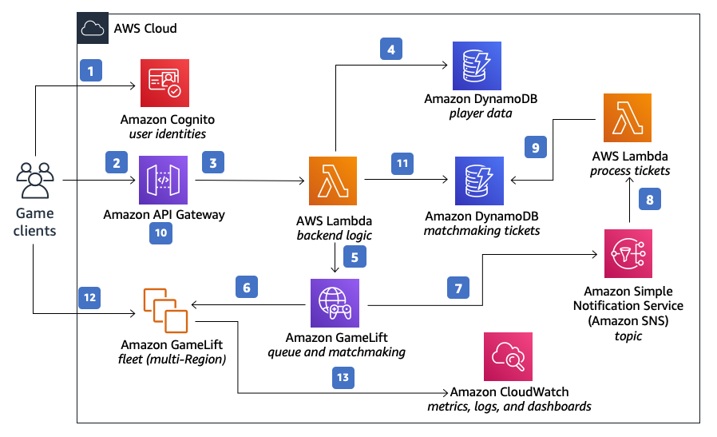
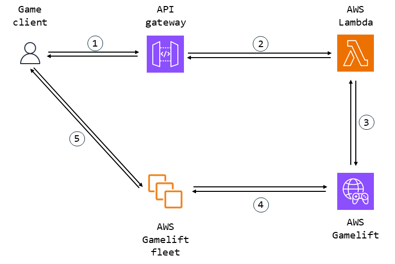

# Guide : Conception

## Philosophie de Conception

L'idée derrière le plugin original était de créer quelque chose qui fonctionnerai rapidement sans trop prendre de temps parce que comme tous bon programmeur qui se respecte : je suis paresseux.

Mais je voulais un outil utilisable par quiconque ayant un minimum de connaissances en Unreal.

J'ai donc choisi d'intégrer la connexion Gamelift (qui jusqu'alors était montrée uniquement pour une connexion distante à Gamelift, et en le faisant directement) en utilisant l'interface Online SubSystem d'Unreal, et de faire en sorte qu'il utilise une solution locale (comme Gamelift Anywhere, ou à l'époque le SDK hérité, car c'était le seul disponible).

De plus, il est écrit dans le README, mais pour mon projet scolaire, je n'avais d'autre choix que d'utiliser AWS, et nous n'avions pas de crédits, donc tout le développement côté serveur devait être fait localement, ce qui a motivé le développement d'une configuration testée localement mais facilement reproductible sur le serveur (pour quand nous aurions les crédits).

Passons en revue et présentons les outils de la solution.

## Online SubSystem d'Unreal

L'Online SubSystem d'Unreal (OSS) est une tentative de l'équipe d'Unreal de créer une interface agnostique à la plateforme pour toute communication avec les back-ends serveur, qui ne tourne pas autour de la réplication et de la logique de jeu.

Cela concerne des choses comme l'accès aux bases de données, la messagerie vocale, ou la connexion des clients aux sessions de jeu du serveur, le dernier étant notre objectif.

Jetons un coup d'œil rapide à l'implémentation de base :

```cpp
/**
 *	OnlineSubsystem - Série d'interfaces pour soutenir la communication avec divers services web/plateformes
 */
class ONLINESUBSYSTEM_API IOnlineSubsystem
{
protected:
	/** Caché intentionnellement */
	IOnlineSubsystem() {}

	FOnlineNotificationHandlerPtr OnlineNotificationHandler;
	FOnlineNotificationTransportManagerPtr OnlineNotificationTransportManager;

public:
	
	virtual ~IOnlineSubsystem() {}

    ...

	/** 
	 * Détermine si le sous-système pour une interface donnée est activé par configuration et ligne de commande
	 * @param SubsystemName - Nom du service en ligne demandé
	 * @return vrai si le sous-système est activé par configuration
	 */
	static bool IsEnabled(const FName& SubsystemName, const FName& InstanceName = NAME_None);

	/**
	 * Retourne le nom du sous-système @see OnlineSubsystemNames.h
	 *
	 * @return le nom du sous-système, tel qu'utilisé dans les appels à IOnlineSubsystem::Get()
	 */
	virtual FName GetSubsystemName() const = 0;

	/**
	 * Obtenez le nom de l'instance, qui est généralement "default" ou "none" mais distingue
	 * une instance d'une autre en mode "Play In Editor". La plupart des plateformes ne peuvent pas faire cela
	 * à cause des exigences des tiers qui n'autorisent qu'une connexion par instance de machine
	 *
	 * @return le nom de l'instance de ce sous-système
	 */
	virtual FName GetInstanceName() const = 0;

	/**
	 * Obtenez la plateforme en ligne locale basée sur la détermination du matériel au moment de la compilation.
	 * @see OnlineSubsystemNames.h OSS_PLATFORM_NAME_*
	 * @return représentation en chaîne du nom de la plateforme en ligne
	 */
	static FString GetLocalPlatformName();

	/** @return vrai si le sous-système est activé, faux sinon */
	virtual bool IsEnabled() const = 0;

	/** 
	 * Obtenez l'interface pour accéder aux services de gestion de session
	 * @return Pointeur d'interface pour le service de session approprié
	 */
	virtual IOnlineSessionPtr GetSessionInterface() const = 0;
	
	/** 
	 * Obtenez l'interface pour accéder aux services de gestion des amis des joueurs
	 * @return Pointeur d'interface pour le service d'amis approprié
	 */
	virtual IOnlineFriendsPtr GetFriendsInterface() const = 0;

	...
};
```

La définition de la classe est très longue, donc j'ai remplacé des parties par des points de suspensions pour la raccourcir. L'idée est simple : une classe longue avec des méthodes à remplacer, et utiliser l'héritage et le polymorphisme pour utiliser un back-end spécifique tout en utilisant le même objet.

Voici un exemple de classe enfant, l'OSS Null qui implémente les fonctionnalités LAN :

```cpp
/**
 *	OnlineSubsystemNull - Implémentation du sous-système en ligne pour les services Null
 */
class ONLINESUBSYSTEMNULL_API FOnlineSubsystemNull : 
	public FOnlineSubsystemImpl
{

public:

	virtual ~FOnlineSubsystemNull() = default;

	// IOnlineSubsystem

	virtual IOnlineSessionPtr GetSessionInterface() const override;
	virtual IOnlineFriendsPtr GetFriendsInterface() const override;
	virtual IOnlinePartyPtr GetPartyInterface() const override;
	virtual IOnlineGroupsPtr GetGroupsInterface() const override;
	virtual IOnlineSharedCloudPtr GetSharedCloudInterface() const override;
	virtual IOnlineUserCloudPtr GetUserCloudInterface() const override;
	virtual IOnlineEntitlementsPtr GetEntitlementsInterface() const override;
	virtual IOnlineLeaderboardsPtr GetLeaderboardsInterface() const override;
	virtual IOnlineVoicePtr GetVoiceInterface() const override;
	virtual IOnlineExternalUIPtr GetExternalUIInterface() const override;	
	virtual IOnlineTimePtr GetTimeInterface() const override;
	virtual IOnlineIdentityPtr GetIdentityInterface() const override;
	virtual IOnlineTitleFilePtr GetTitleFileInterface() const override;
	virtual IOnlineStoreV2Ptr GetStoreV2Interface() const override;
	virtual IOnlinePurchasePtr GetPurchaseInterface() const override;
	virtual IOnlineEventsPtr GetEventsInterface() const override;
	virtual IOnlineAchievementsPtr GetAchievementsInterface() const override;
	virtual IOnlineSharingPtr GetSharingInterface() const override;
	virtual IOnlineUserPtr GetUserInterface() const override;
	virtual IOnlineMessagePtr GetMessageInterface() const override;
	virtual IOnlinePresencePtr GetPresenceInterface() const override;
	virtual IOnlineChatPtr GetChatInterface() const override;
	virtual IOnlineStatsPtr GetStatsInterface() const override;
	virtual IOnlineTurnBasedPtr GetTurnBasedInterface() const override;
	virtual IOnlineTournamentPtr GetTournamentInterface() const override;
	virtual IMessageSanitizerPtr GetMessageSanitizer(int32 LocalUserNum, FString& OutAuthTypeToExclude) const override;

	virtual bool Init() override;
	virtual bool Shutdown() override;
	virtual FString GetAppId() const override;
	virtual bool Exec(class UWorld* InWorld, const TCHAR* Cmd, FOutputDevice& Ar) override;
	virtual FText GetOnlineServiceName() const override;

	// FTickerObjectBase
	
	virtual bool Tick(float DeltaTime) override;

	// FOnlineSubsystemNull

PACKAGE_SCOPE:

	/** Seule la fabrique crée des instances */
	FOnlineSubsystemNull() = delete;
	explicit FOnlineSubsystemNull(FName InInstanceName) :
		FOnlineSubsystemImpl(NULL_SUBSYSTEM, InInstanceName),
		SessionInterface(nullptr),
		VoiceInterface(nullptr),
		bVoiceInterfaceInitialized(false),
		LeaderboardsInterface(nullptr),
		IdentityInterface(nullptr),
		AchievementsInterface(nullptr),
		StoreV2Interface(nullptr),
		MessageSanitizerInterface(nullptr),
		OnlineAsyncTaskThreadRunnable(nullptr),
		OnlineAsyncTaskThread(nullptr)
	{}

private:

	/** Interface aux services de session */
	FOnlineSessionNullPtr SessionInterface;

	/** Interface pour la communication vocale */
	mutable IOnlineVoicePtr VoiceInterface;

	/** Interface pour la communication vocale */
	mutable bool bVoiceInterfaceInitialized;

	/** Interface aux services de classements */
	FOnlineLeaderboardsNullPtr LeaderboardsInterface;

	/** Interface pour l'enregistrement/authentification d'identité */
	FOnlineIdentityNullPtr IdentityInterface;

	/** Interface pour les réalisations */
	FOnlineAchievementsNullPtr AchievementsInterface;

	/** Interface pour le store */
	FOnlineStoreV2NullPtr StoreV2Interface;

	/** Interface pour les achats */
	FOnlinePurchaseNullPtr PurchaseInterface;

	/** Interface pour la désinfection des messages */
	FMessageSanitizerNullPtr MessageSanitizerInterface;

	/** Tâche asynchrone en ligne */
	class FOnlineAsyncTaskManagerNull* OnlineAsyncTaskThreadRunnable;

	/** Thread asynchrone en ligne */
	class FRunnableThread* OnlineAsyncTaskThread;

	// compteur de tâches, utilisé pour générer des noms de threads uniques pour chaque tâche
	static FThreadSafeCounter TaskCounter;
};
```

Simple, n'est-ce pas ? Tout est remplacé et toutes les interfaces pour les fonctionnalités existent dans la classe.

De nombreuses plateformes ont leur implémentation : Epic Online Services (probablement la meilleure en termes de fonctionnement), Steam (fonctionne pour la plupart des éléments importants, mais avec quelques bugs sur certaines fonctionnalités), IOS, Android...

Mais alors, si toutes ces plateformes ont des implémentations, AWS devrait en avoir une, non ?
La réponse est oui ! Le sous-système Amazon OSS existe, voyons-ça.

```cpp

/**
 * Sous-système Amazon
 */
class ONLINESUBSYSTEMAMAZON_API FOnlineSubsystemAmazon :
	public FOnlineSubsystemImpl
{
	class FOnlineFactoryAmazon* AmazonFactory;

	/** Interface pour les services d'enregistrement/authentification d'identité */
	FOnlineIdentityAmazonPtr IdentityInterface;

	/** Utilisé pour basculer entre 1 et 0 */
	int TickToggle;

PACKAGE_SCOPE:

	/** Seule la fabrique crée des instances */
	FOnlineSubsystemAmazon() = delete;
	explicit FOnlineSubsystemAmazon(FName InInstanceName);

public:
	// IOnlineSubsystem

	virtual IOnlineSessionPtr GetSessionInterface() const override { return nullptr; }
	virtual IOnlineFriendsPtr GetFriendsInterface() const override { return nullptr; }
	virtual IOnlinePartyPtr GetPartyInterface() const override { return nullptr; }
	virtual IOnlineGroupsPtr GetGroupsInterface() const override { return nullptr; }
	virtual IOnlineSharedCloudPtr GetSharedCloudInterface() const override { return nullptr; }
	virtual IOnlineUserCloudPtr GetUserCloudInterface() const override { return nullptr; }
	virtual IOnlineLeaderboardsPtr GetLeaderboardsInterface() const override { return nullptr; }
	virtual IOnlineVoicePtr GetVoiceInterface() const override { return nullptr; }
	virtual IOnlineExternalUIPtr GetExternalUIInterface() const override { return nullptr; }
	virtual IOnlineTimePtr GetTimeInterface() const override { return nullptr; }
	virtual IOnlineTitleFilePtr GetTitleFileInterface() const override { return nullptr; }
	virtual IOnlineEntitlementsPtr GetEntitlementsInterface() const override { return nullptr; }
	virtual IOnlineIdentityPtr GetIdentityInterface() const override;
	virtual IOnlineStoreV2Ptr GetStoreV2Interface() const override { return nullptr; }
	virtual IOnlinePurchasePtr GetPurchaseInterface() const override { return nullptr; }
	virtual IOnlineEventsPtr GetEventsInterface() const override { return nullptr; }
	virtual IOnlineAchievementsPtr GetAchievementsInterface() const override { return nullptr; }
	virtual IOnlineSharingPtr GetSharingInterface() const override { return nullptr; }
	virtual IOnlineUserPtr GetUserInterface() const override { return nullptr; }
	virtual IOnlineMessagePtr GetMessageInterface() const override { return nullptr; }
	virtual IOnlinePresencePtr GetPresenceInterface() const override { return nullptr; }
	virtual IOnlineChatPtr GetChatInterface() const override { return nullptr; }
	virtual IOnlineStatsPtr GetStatsInterface() const override { return nullptr; }
	virtual IOnlineTurnBasedPtr GetTurnBasedInterface() const override { return nullptr; }
	virtual IOnlineTournamentPtr GetTournamentInterface() const override { return nullptr; }

	virtual bool Init() override;
	virtual bool Shutdown() override;
	virtual FString GetAppId() const override;
	virtual bool Exec(class UWorld* InWorld, const TCHAR* Cmd, FOutputDevice& Ar) override;
	virtual FText GetOnlineServiceName() const override;
	virtual bool IsEnabled() const override;

	// FTickerBaseObject

	virtual bool Tick(float DeltaTime) override;

	// FOnlineSubsystemAmazon

	/**
	 * Destructeur
	 */
	virtual ~FOnlineSubsystemAmazon();
};
```

Il n'implémente que l'IdentityInterface.
Au risque de paraitre dur, c'est complètement inutile.

Il y a aussi eu une tentative de création d'un OSS en 2016, qui est maintenant obsolète.
Vous pouvez [le consulter ici](https://github.com/gameDNAstudio/AmazonServices) si cela vous intéresse.

Mais pourquoi ne pas le rendre plus utile alors ? J'ai une théorie.
Peut-être que la philosophie de conception d'AWS ne fonctionne tout simplement pas avec les limitations d'intégration requises par l'OSS.

Pour notre besoin, je dois en fait uniquement remplacer la SessionInterface, donc ce n'est pas très éloigné de simplement implémenter l'IdentityInterface, mais comme je veux quelque chose qui fonctionne et que je peux utiliser facilement, cela me suffit.

Maintenant que nous comprenons mieux le système côté client, voyons à quoi ressemble notre serveur.

## Amazon Web Services

Amazon Web Services (AWS en abrégé) est à la fois une solution de serveur et de développement de serveur, qui repose sur deux principes architecturaux : [l'Event-Driven Architecture](https://aws.amazon.com/event-driven-architecture/) et ['Infrastructure as a Service (IaaS)](https://aws.amazon.com/fr/what-is/iaas/)/[le Cloud Computing](https://aws.amazon.com/what-is-cloud-computing/?nc1=h_ls).

Si vous souhaitez en savoir plus sur le cadre d'AWS, [voici leur documentation](https://docs.aws.amazon.com/en_us/wellarchitected/2022-03-31/framework/welcome.html) (bien qu'un peu ancienne même au moment de l'écriture).

En résumé, AWS fonctionne en ayant tout plein de très petit composant, et en connectant ces petits outils qui font une seule chose bien pour créer votre propre solution personnalisée.

C'est une philosophie similaire à celle du ["Faire une chose et la faire bien"](https://en.wikipedia.org/wiki/Unix_philosophy) de la communauté UNIX.

L'exemple le plus frappant de cela sont les [Lambdas](https://aws.amazon.com/lambda/).

Ce sont des fonctions qui peuvent être appelées de partout, et qui ne doivent pas dépasser 10 lignes de code pour s'exécuter, l'idée étant que les lambdas peuvent appeler d'autres lambdas et que, en raison de l'Event-Driven Architecture, ce n'est pas un serveur attendant d'exécuter le code, juste une fonction qui sera appelée lorsqu'on le demandera, sur le serveur d'AWS.

Les principaux avantages résident dans sa capacité à [se scale horizontalement](https://en.wikipedia.org/wiki/Database_scalability).

En résumé, comme tout dans AWS est un service (que ce soit pour exécuter des fonctions avec Lambda ou pour héberger un serveur de jeu pendant une période avec GameLift), et que vous n'avez pas à créer votre propre serveur, si la demande augmente ou diminue soudainement, avec des services basée sur de l'Event-Driven Architecture, l'utilisation des ressources suit la demande, et vous ne payez que ce que vous utilisez.

Tout ça c'est le discours commercial, en pratique il est beaucoup plus difficile de configurer quelque chose qui suit de près la demande, sans perdre en temps de calcul.

Alors, dans notre cas, à quoi ressemble notre utilisation d'AWS ?

[Voici](https://docs.aws.amazon.com/architecture-diagrams/latest/multiplayer-session-based-game-hosting-on-aws/multiplayer-session-based-game-hosting-on-aws.html) ce qu'AWS présente sur son site.



C'est une vue assez complète des capacités d'AWS.
Il y a beaucoup de fonctionnalités : connexion des comptes utilisateurs, base de données, matchmaking, données et analyses de jeu, etc.

Mais c'est un peu trop pour notre application simple qui souhaite simplement les mêmes fonctionnalités qu'une connexion LAN mais sur AWS.

Si nous éliminons tout ce qui est "inutile", ça donne ça.



Ici, tout sauf le client est dans le "Cloud AWS".
Voyons les composants de notre solution un par un.

1. <picture> <source media="(prefers-color-scheme: dark)" srcset="../../Media/Dark/Res_User_48_Dark.svg"> <source media="(prefers-color-scheme: light)" srcset="../../Media/Light/Res_User_48_Light.svg">  </picture> du Client jusqu'à  la communication avec API Gateway.

AWS est assez strict en matière de sécurité, donc nous ne pouvons pas communiquer directement avec les blocs à l'intérieur de notre solution (comme GameLift), pour obtenir un serveur.
Dans le cas de la communication avec une GameSession directement, vous devez demander à GameLift d'ouvrir un port public sur une fleet pour communiquer temporairement avec le client.

Le seul accès pour les connexions publiques avec AWS est appelé [API Gateway](https://aws.amazon.com/api-gateway/), qui, comme son nom l'indique, est une passerelle pour accéder à tout dans le Cloud AWS, depuis l'extérieur de celui-ci.

API Gateway peut être à la fois une API Rest ou WebSocket, maisnous allons l'utiliser simplement comme moyen de communiquer avec AWS via des requêtes http.

1.  API Gateway vers  l'execution de Lambda

Malheureusement, nous ne pouvons pas créer un événement sur API Gateway pour faire toute la configuration nécessaire pour notre serveur, puis répondre avec les données nécessaires.
Nous aurons besoin de créer des fonctions et de le faire en code.
Donc, dans notre solution, API Gateway est juste là pour exécuter les [Lambdas](https://aws.amazon.com/lambda/), qui sont des fonctions pouvant faire presque tout à l'intérieur de l'AWS Cloud.

Comme nous sommes en local il n'y aura pas de considérations pour la sécurité, mais vous devriez absolument vous pencher sur cette question si vous avez l'intention de déployer votre solution.

3.  Lambdas interagissant avec  AWS GameLift

Lors de l'exécution des lambdas, en utilisant les outils fournis par AWS, nous serons en mesure de créer des GameSessions, des PlayerSessions et de rechercher des ressources de [GameLift](https://aws.amazon.com/gamelift/) en code.

Ces ressources seront formatées en réponse HTTP pour être disponibles au client.

1.  GameLift initialisant des instances sur une fleet 

Les fleet sont des ressources sur GameLift, généralement synonymes d'un serveur dans une région du monde.

Pour notre cas d'utilisation, nous en définissons une comme "nous-mêmes" (redirigeant essentiellement vers "localhost"). Si vous ne l'avez pas fait, consultez [comment faire fonctionner le projet](../Usage/Run.md).

5.  Game Session sur une fleet se connectant directement avec <picture> <source media="(prefers-color-scheme: dark)" srcset="../../Media/Dark/Res_User_48_Dark.svg"> <source media="(prefers-color-scheme: light)" srcset="../../Media/Light/Res_User_48_Light.svg">  </picture> au client

Après avoir été assigné à une session de jeu, le client se connecte directement à l'adresse IP et au port du serveur, qui est ouvert pour une courte période.

Dans notre cas, l'adresse IP est localhost (ou 127.0.0.1), ce qui signifie qu'elle redirige notre connexion réseau pour rechercher sur la machine du client le serveur qui devrait déjà être ouvert sur un certain port.

C'est une solution alambiqués pour simplement rediriger le client vers un serveur qui est sur la même machine, mais malheureusement, c'est ainsi que fonctionnent les connexions sur AWS.
Et pour de bonnes raisons, car ce système est facilement extensible pour fonctionner sur plusieurs serveurs dans le monde entier, même si cela ne concerne pas notre champ d'application.

## En détail

Maintenant que nous avons couvert le design général de la solution, plongeons dans son fonctionnement et examinons les trois principales méthodes implémentées dans le plugin.

- [Faire en sorte que AWSOSS lance des requêtes HTTP vers API Gateway](AWSOSS.md)
- [Créer une session](CreateSession.md)
- [Trouver une session](FindSession.md)
- [Rejoindre une session](JoinSessiond.md)