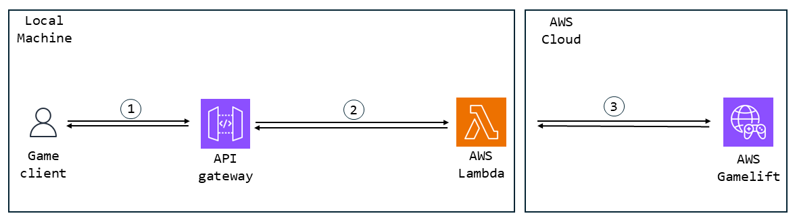

# Trouver une Session

Après avoir créé une session, nous avons besoin que d'autres utilisateurs puissent se joindre à la session de jeu. Voyons comment nous pouvons lister les sessions de jeu créées pour que nos utilisateurs puissent choisir et rejoindre.

## Table des matières

- [Trouver une Session](#trouver-une-session)
  - [Table des matières](#table-des-matières)
  - [Architecture de la solution](#architecture-de-la-solution)
    - [Architecture Gamelift Anywhere](#architecture-gamelift-anywhere)
    - [Architecture Gamelift Legacy](#architecture-gamelift-legacy)
  - [Find Session Request](#find-session-request)
  - [Lambda pour FindSession](#lambda-pour-findsession)
    - [SDK Anywhere pour Trouver des Sessions](#sdk-anywhere-pour-trouver-des-sessions)
    - [SDK Legacy pour Trouver des Sessions](#sdk-legacy-pour-trouver-des-sessions)
  - [Méthode Find Session Response](#méthode-find-session-response)

## Architecture de la solution

La solution tente de reproduire l'implémentation LAN de l'OSS Null. Donc, la solution actuelle consiste simplement à recueillir les informations sur les GameSession créées, avec des `SessionSearch` dans l'OSS, et à laisser la mise en œuvre réelle à l'utilisateur. Il suffit donc de récupérer les données de la session de jeu.

Cela signifie que l'architecture est assez similaire à celle pour créer des GameSession, la seule différence étant qu'il n'y a pas de connexion.

### Architecture Gamelift Anywhere



Les échanges se font par la même méthode que celle expliquée dans la [section créer une session](CreateSession.md#architecture-gamelift-anywhere). C'est-à-dire :

1. <picture> <source media="(prefers-color-scheme: dark)" srcset="../../Media/Dark/Res_User_48_Dark.svg"> <source media="(prefers-color-scheme: light)" srcset="../../Media/Light/Res_User_48_Light.svg">  </picture> Le client et  API Gateway échangent par des requêtes HTTP depuis l'OSS (en utilisant les URL pour pointer vers SAM API Gateway).

2.  SAM API Gateway utilise Docker pour initialiser ses  Lambdas et les exécuter.

3.  Les Lambdas accèdent à  AWS Gamelift en utilisant les identifiants dans l'AWS CLI.

### Architecture Gamelift Legacy


Encore une fois, c'est la même méthode que celle expliquée dans la [section créer une session](CreateSession.md#architecture-legacy-gamelift). C'est-à-dire :

1. <picture> <source media="(prefers-color-scheme: dark)" srcset="../../Media/Dark/Res_User_48_Dark.svg"> <source media="(prefers-color-scheme: light)" srcset="../../Media/Light/Res_User_48_Light.svg">  </picture> Le client et  API Gateway échangent par des requêtes HTTP depuis l'OSS (en utilisant les URL pour pointer vers l'API Gateway de SAM).

2.  SAM API Gateway utilise Docker pour initialiser ses  Lambdas et les exécuter.

3.  Les Lambdas accèdent à  AWS Gamelift en pointant directement vers le port sur la machine où le Gamelift Legacy est exécuté.

## Find Session Request

Pour accéder aux informations des sessions de jeu sur Gamelift, nous devons envoyer une requête HTTP pour appeler une lambda.

La méthode de requête sera très similaire à celle que nous avons vue pour StartSession, car la logique est assez similaire.

[Voici](../../Plugins/AWSOSS/Source/AWSOSS/Private/OnlineSessionInterfaceAWS.cpp#L487) la méthode.

```cpp
bool FOnlineSessionAWS::FindSessions(int32 SearchingPlayerNum, const TSharedRef<FOnlineSessionSearch>& SearchSettings)
{
	uint32 Return = ONLINE_FAIL;

	if (SearchSettings->bIsLanQuery)
	{
		Return = AWSSubsystem->GetLANSessionInterface()->FindSessions(SearchingPlayerNum, SearchSettings) ? ONLINE_SUCCESS : Return;
	}// Ne pas commencer une autre recherche pendant qu'une est en cours
	else if (!CurrentSessionSearch.IsValid() && SearchSettings->SearchState != EOnlineAsyncTaskState::InProgress)
	{
		// Libérer les résultats précédents
		SearchSettings->SearchResults.Empty();

		// Copier le pointeur de recherche pour le garder
		CurrentSessionSearch = SearchSettings;

		// Se souvenir du temps auquel nous avons commencé la recherche, car cela sera utilisé pour une estimation du ping "assez bonne"
		SessionSearchStartInSeconds = FPlatformTime::Seconds();

		// Réinitialiser le minuteur de délai
		FindSessionRequestTimer = 0.0f;

		Return = ONLINE_IO_PENDING;

		if (Return == ONLINE_IO_PENDING)
		{
			SearchSettings->SearchState = EOnlineAsyncTaskState::InProgress;

			IAWSHttpRequest FindSessionRequest = AWSSubsystem->MakeRequest(FindSessionURI, TEXT("GET"));
			FindSessionRequest->OnProcessRequestComplete().BindRaw(this, &FOnlineSessionAWS::OnFindSessionsResponseReceived);
			FindSessionRequest->ProcessRequest();
		}
	}
	else
	{
		UE_LOG_ONLINE_UC(Warning, TEXT("Ignorer la demande de recherche de jeu pendant qu'une est en attente"));
		Return = ONLINE_IO_PENDING;
	}

	return Return == ONLINE_SUCCESS || Return == ONLINE_IO_PENDING;
}
```

Les seules différences avec la [méthode StartSession](CreateSession.md#méthode-start-session-request) sont qu'il s'agit d'une requête GET, et non POST, car nous ne modifions pas le serveur mais demandons simplement des données, et que nous utilisons `FindSessionURI`.

À part ça, c'est assez similaire.

## Lambda pour FindSession

Similaire à la [lambda de création de sessions](CreateSession.md#lambda-de-création-de-session), il existe deux versions de cette lambda : la version [SDK Anywhere](#sdk-anywhere-pour-trouver-des-sessions) et la version [SDK Legacy](#sdk-legacy-pour-trouver-des-sessions).

### SDK Anywhere pour Trouver des Sessions

Comparée à la lambda de création de sessions, la lambda de recherche de sessions est en fait assez courte, car elle a seulement besoin de demander des données à Gamelift et de renvoyer une réponse HTTP avec celles-ci.

[Voici](../../../Plugins/AWSOSS/SAM/find_session/app.py) la fonction :

```py
def lambda_handler(event, context):
	
	print("dans find_session")

	# La réponse finale de cette requête
	response = {}
	
	# L'identifiant de la flotte dans laquelle nous allons créer notre session de jeu
	my_fleet_id = get_my_fleet_id(response)
	
	# Erreur lors de l'obtention de l'identifiant de la flotte, abandonner et envoyer une réponse d'erreur
	if response:
		return response
		
	print("obtention de l'identifiant de la flotte réussie : ", my_fleet_id, "recherche maintenant les sessions de jeu")

	location = game_lift.list_compute(FleetId = my_fleet_id)["ComputeList"][0]["Location"]

	print("résultat de l'obtention de l'emplacement : ", location)

	# Ce que nous essayons de faire ci-dessous est ce qui devrait être fait pour préserver les ressources, mais sur Gamelift local (SDK 4 ou antérieur au moins), la recherche de game_session ne fonctionne pas.
	
	# Essayer de trouver une session de jeu existante dans notre flotte
	game_sessions = game_lift.search_game_sessions(FleetId = my_fleet_id, Location = location, FilterExpression = "hasAvailablePlayerSessions=true")

	print("session de jeu trouvée : ", game_sessions.__str__(), " envoi tel quel")
		
	# Il s'agit d'une simple requête GET, nous devons juste montrer au client ce qui est en cours pour le moment.
	# Nous allons donc simplement envoyer cette réponse brute
	return {
		"statusCode": 200,
		"body" : json.dumps(game_sessions["GameSessions"], default = raw_converter).encode("UTF-8")
	}
```

La plupart des fonctions ont déjà été vues dans la [lambda de création de session](CreateSession.md#création-de-session-anywhere-sdk), que vous pouvez consulter si quelque chose n'est pas clair.

La seule méthode utilisée pour obtenir les GameSession actuellement en cours est [search_game_sessions](https://boto3.amazonaws.com/v1/documentation/api/latest/reference/services/gamelift/client/search_game_sessions.html).

Il existe quelques fonctions que vous pouvez utiliser pour récupérer les données de GameSession, mais l'avantage de `search_game_sessions` est qu'elle peut filtrer les GameSession en fonction des paramètres.

Cela dépasse notre périmètre, mais vous pourriez remplacer la requête par une requête POST et fournir des données pour filtrer les GameSession souhaitées parmi celles actives. Le seul filtre utilisé ici pour illustrer cette fonctionnalité est le fait que nous ne répondrons qu'avec les GameSessions qui ne sont pas encore complètes (en d'autres termes, pouvant créer d'autres PlayerSessions).

C'est aussi la seule différence avec le SDK Legacy.

### SDK Legacy pour Trouver des Sessions

[Voici](../../../Plugins/AWSOSS/SAM/find_session_local/app.py) la fonction du SDK Legacy :

```py
def lambda_handler(event, context):
	
	print("dans find_session")

	# La réponse finale de cette requête
	response = {}
	
	# L'identifiant de la flotte dans laquelle nous allons créer notre session de jeu.
	# Dans Gamelift local (SDK 4.0), cela n'a en fait pas d'importance, tant que nous avons le même tout au long.
	my_fleet_id = global_fleet_id
	
	# Erreur lors de l'obtention de l'identifiant de la flotte, abandonner et envoyer une réponse d'erreur
	if response:
		return response
		
	print("obtention de l'identifiant de la flotte réussie : ", my_fleet_id, "recherche maintenant les sessions de jeu")
	
	# Essayer de trouver une session de jeu existante dans notre flotte
	# La recherche de sessions n'existe pas dans Gamelift local, donc nous utiliserons describe_game_sessions
	# Notez que nous n'avons pas de filtre. C'est un problème avec cette implémentation, mais c'est un environnement trop petit pour que cela ait vraiment de l'importance.
	game_sessions = game_lift.describe_game_sessions(FleetId = my_fleet_id)

	print("session de jeu trouvée : ", game_sessions.__str__(), " envoi tel quel")
		
	# Il s'agit d'une simple requête GET, nous devons juste montrer au client ce qui est en cours pour le moment.
	# Nous allons donc simplement envoyer cette réponse brute
	return {
		"statusCode": 200,
		"body" : json.dumps(game_sessions["GameSessions"], default = raw_converter).encode("UTF-8")
	}
```

Encore une fois, très similaire à l'implémentation de la [lambda de création de session dans le SDK Legacy](CreateSession.md#création-de-session-avec-le-sdk-legacy), mais avec une seule fonction différente.

Alors, pourquoi ne pas utiliser la même fonction "search_game_session" pour obtenir les données de nos GameSession avec un filtre ? La réponse est simple : parce que nous ne pouvons pas.

Il est écrit dans [la documentation d'AWS](https://docs.aws.amazon.com/gamelift/latest/developerguide/integration-testing-local.html) que le SDK Legacy de Gamelift local ne prend en charge que quelques API :

- CreateGameSession
- CreatePlayerSession
- CreatePlayerSessions
- DescribeGameSessions
- DescribePlayerSessions

Nous n'avons donc pas le choix de la fonction à utiliser pour obtenir les informations sur les GameSessions disponibles et actives.

Maintenant que la requête nous fournit des données sur les GameSessions, traitons la réponse.

## Méthode Find Session Response

[Voici](../../../Plugins/AWSOSS/Source/AWSOSS/Private/OnlineSessionInterfaceAWS.cpp#L531) la méthode.

```cpp
void FOnlineSessionAWS::OnFindSessionsResponseReceived(FHttpRequestPtr Request, FHttpResponsePtr Response, bool bConnectedSuccessfully)
{
	ProcessHttpRequest();
	
	/** Cela peut arriver dans deux cas :
	* - une réponse d'une requête précédente est arrivée après le délai d'attente, nous l'ignorons car nous la considérons comme échouée
	* - une réponse de cette requête est arrivée après le délai d'attente, même cas nous l'ignorons. */
	if (CurrentSessionSearch->SearchState != EOnlineAsyncTaskState::InProgress)
		return;

	// Nous avons reçu des sessions sans erreurs, donc nous considérons que le résultat est satisfaisant
	// s'il n'y a pas de GameSession, c'est en fait une conclusion plausible, il n'y a tout simplement personne avec une GameSession en ce moment
	Result = ONLINE_SUCCESS;

	// Calculons notre approximation de ping, au moins mieux que rien
	int32 VeryBadPingApproximate = FPlatformTime::Seconds() - SessionSearchStartInSeconds;

	TArray<TSharedPtr<FJsonValue>> GameSessions = response->AsArray();
	for (int32 i = 0; i < GameSessions.Num(); i++)
	{
		// Récupération des GameSessions en tant qu'objet pour faciliter l'extraction des données souhaitées
		TSharedPtr<FJsonObject> GameSession = GameSessions[i]->AsObject();

		// La structure utilisée pour remplir les données de la GameSession AWS
		FOnlineSessionSearchResult SearchResult;

		SearchResult.PingInMs = VeryBadPingApproximate;

		// Nous n'avons pas encore implémenté de GameSessions privées ou publiques, donc nous allons remplir les deux pour que cela fonctionne de la même manière
		{
			// remplissage du nombre maximum de PlayerSessions
			SearchResult.Session.SessionSettings.NumPublicConnections = GameSession->GetNumberField(TEXT("MaximumPlayerSessionCount"));
			SearchResult.Session.SessionSettings.NumPrivateConnections = SearchResult.Session.SessionSettings.NumPublicConnections;

			// PlayerSessions actuellement disponibles
			SearchResult.Session.NumOpenPublicConnections = SearchResult.Session.SessionSettings.NumPublicConnections - GameSession->GetNumberField(TEXT("CurrentPlayerSessionCount"));
			SearchResult.Session.NumOpenPrivateConnections = SearchResult.Session.NumOpenPublicConnections;
		}

		// Définir le nom convivial, choisi par le propriétaire de la GameSession
		SearchResult.Session.SessionSettings.Set(TEXT("Name"), GameSession->GetStringField("Name"));
		// Définir l'ID de la GameSession, au cas où l'utilisateur souhaiterait rejoindre cette session (cela doit être opaque pour l'utilisateur et ne jamais être vu, mais nous devons quand même le sauvegarder quelque part)
		SearchResult.Session.SessionSettings.Set(TEXT("GameSessionId"), GameSession->GetStringField("GameSessionId"));

		CurrentSessionSearch->SearchResults.Add(SearchResult);
	}
	
	CurrentSessionSearch->SearchState = EOnlineAsyncTaskState::Done;
	TriggerOnFindSessionsCompleteDelegates((Result == ONLINE_SUCCESS) ? true : false);
}
```

Voyons cela en détail.

Tout d'abord, nous vérifions que la réponse est valide et qu'elle n'est pas arrivée trop tard.

```cpp
void FOnlineSessionAWS::OnFindSessionsResponseReceived(FHttpRequestPtr Request, FHttpResponsePtr Response, bool bConnectedSuccessfully)
{
	ProcessHttpRequest();
	
	/** Cela peut arriver dans deux cas :
	* - une réponse d'une requête précédente est arrivée après le délai d'attente, nous l'ignorons car nous la considérons comme échouée
	* - une réponse de cette requête est arrivée après le délai d'attente, même cas nous l'ignorons. */
	if (CurrentSessionSearch->SearchState != EOnlineAsyncTaskState::InProgress)
		return;
```

Ensuite, nous parcourons le nombre de GameSessions que la réponse nous a fournies et créons un objet `SessionSearchResult` (qui est un objet OSS) pour chacune d'elles.

```cpp
// Calculons notre approximation de ping, au moins mieux que rien
	int32 VeryBadPingApproximate = FPlatformTime::Seconds() - SessionSearchStartInSeconds;

	TArray<TSharedPtr<FJsonValue>> GameSessions = response->AsArray();
	for (int32 i = 0; i < GameSessions.Num(); i++)
	{
		// Récupération des GameSessions en tant qu'objet pour faciliter l'extraction des données souhaitées
		TSharedPtr<FJsonObject> GameSession = GameSessions[i]->AsObject();

		// La structure utilisée pour remplir les données de la GameSession AWS
		FOnlineSessionSearchResult SearchResult;

		SearchResult.PingInMs = VeryBadPingApproximate;
```

Nous ajoutons ensuite les données appropriées aux résultats de recherche, qui sont :

- Nombre maximum de joueurs
- Nombre actuel de joueurs
- Nom de la session
- ID de la GameSession

```cpp
		// Nous n'avons pas encore implémenté de GameSessions privées ou publiques, donc nous allons remplir les deux pour que cela fonctionne de la même manière
		{
			// remplissage du nombre maximum de PlayerSessions
			SearchResult.Session.SessionSettings.NumPublicConnections = GameSession->GetNumberField(TEXT("MaximumPlayerSessionCount"));
			SearchResult.Session.SessionSettings.NumPrivateConnections = SearchResult.Session.SessionSettings.NumPublicConnections;

			// PlayerSessions actuellement disponibles
			SearchResult.Session.NumOpenPublicConnections = SearchResult.Session.SessionSettings.NumPublicConnections - GameSession->GetNumberField(TEXT("CurrentPlayerSessionCount"));
			SearchResult.Session.NumOpenPrivateConnections = SearchResult.Session.NumOpenPublicConnections;
		}

		// Définir le nom convivial, choisi par le propriétaire de la GameSession
		SearchResult.Session.SessionSettings.Set(TEXT("Name"), GameSession->GetStringField("Name"));
		// Définir l'ID de la GameSession, au cas où l'utilisateur souhaiterait rejoindre cette session (cela doit être opaque pour l'utilisateur et ne jamais être vu, mais nous devons quand même le sauvegarder quelque part)
		SearchResult.Session.SessionSettings.Set(TEXT("GameSessionId"), GameSession->GetStringField("GameSessionId"));

		CurrentSessionSearch->SearchResults.Add(SearchResult);
	}
	
	CurrentSessionSearch->SearchState = EOnlineAsyncTaskState::Done;
	TriggerOnFindSessionsCompleteDelegates((Result == ONLINE_SUCCESS) ? true : false);
```

Gardez à l'esprit que ce que vous pouvez mettre ce que vous voulez dans les `SearchResults`, et que ceci n'est qu'une implémentation de base. Vous pourriez vouloir ajouter plus de fonctionnalités, comme trier la liste des GameSessions pour l'utilisateur.

La fonction appelle le callback à la fin pour que les résultats de recherche puissent être utilisés ailleurs.

L'utilisation attendue serait de créer un menu de sessions en listant les GameSessions pour permettre à l'utilisateur de choisir sa propre session.

> [!NOTE]
> Cela dépasse largement le cadre, mais il peut être préférable de ne pas envoyer *toutes les données* concernant vos GameSessions à votre client, car cela pourrait être utilisé de manière malveillante.
> Vous devriez seulement envoyer ce dont vous avez besoin.

> [!WARNING]
> Il peut sembler contre-intuitif, mais bien que j'aie testé cette solution et qu'elle ait fonctionné, je n'ai pas pu tester si la recherche de sessions fonctionnait avec plusieurs sessions, donc il pourrait y avoir un problème.

Maintenant que l'utilisateur peut choisir une GameSession parmi celles disponibles, voyons comment lui permettre de [rejoindre une GameSession](JoinSession.md).
