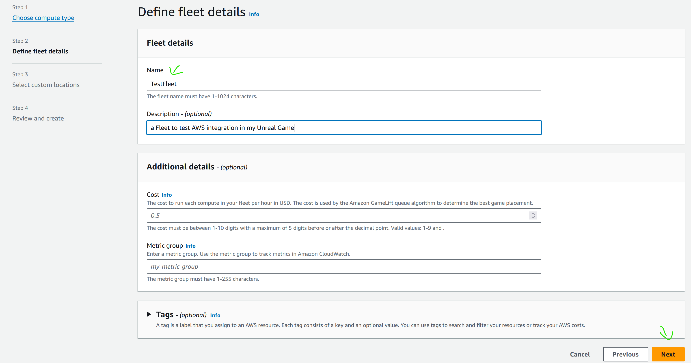
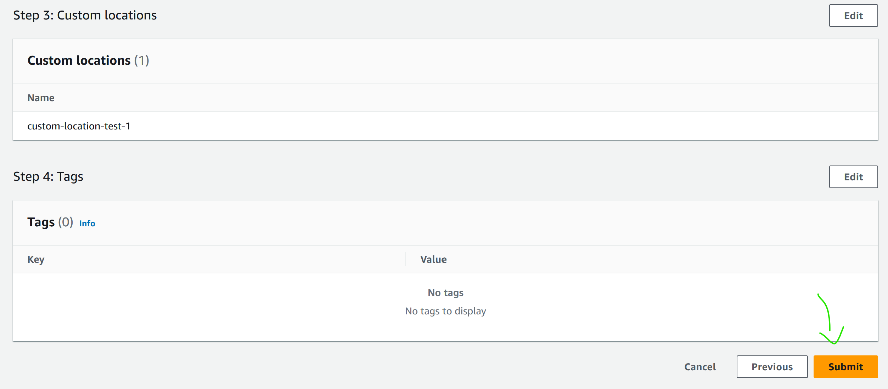

# AWS OSSの実行とテスト

プラグインの設定が完了したので、テストを行う準備が整いました。

Gameliftとの統合をテストするためには、いくつかの要素が必要です：

- [AWS OSSの実行とテスト](#aws-ossの実行とテスト)
  - [ゲームサーバーのビルド](#ゲームサーバーのビルド)
  - [ローカルGameliftの設定](#ローカルgameliftの設定)
    - [Legacy Gameliftの設定](#legacy-gameliftの設定)
    - [新しいGamelift SDKのローカル設定](#新しいgamelift-sdkのローカル設定)
  - [SAM API Gatewayの起動](#sam-api-gatewayの起動)

それでは、詳しく見ていきましょう。

## ゲームサーバーのビルド

ゲームサーバーのビルドについては、[こちらのチュートリアル](https://dev.epicgames.com/documentation/en-us/unreal-engine/setting-up-dedicated-servers?application_version=4.27)（英語）など、多くのガイドがありますが、Gamelift APIと連携させるためには特別な要件があります。

特に、[AWSのドキュメンテーション](https://docs.aws.amazon.com/gamelift/latest/developerguide/integration-testing.html#integration-testing-dev)によれば、Game Instance内に特別なコードを含める必要があります。

[こちら](../../../Source/Private/TestAWSGameInstance.cpp#L53)にそのコードの例があります。

```cpp
// 最初にモジュールを取得します。
	FGameLiftServerSDKModule* gameLiftSdkModule = &FModuleManager::LoadModuleChecked<FGameLiftServerSDKModule>(FName("GameLiftServerSDK"));

	// GameLift Anywhereのfleet用にサーバーのパラメータを設定します。これはGameLiftが管理するEC2 fleetには必要ありません。
	FServerParameters serverParameters;

	// "aws gamelift get-compute-auth-token" APIから返されたAuthToken。これは15分後に期限切れになり、新しいAPI呼び出しが必要です。
	if (FParse::Value(FCommandLine::Get(), TEXT("-authtoken="), serverParameters.m_authToken))
	{
		UE_LOG(GameServerLog, Log, TEXT("AUTH_TOKEN: %s"), *serverParameters.m_authToken)
	}

	// GameLift AnywhereインスタンスのHost/compute-name。
	if (FParse::Value(FCommandLine::Get(), TEXT("-hostid="), serverParameters.m_hostId))
	{
		UE_LOG(GameServerLog, Log, TEXT("HOST_ID: %s"), *serverParameters.m_hostId)
	}

	// Anywhere fleetのID。
	if (FParse::Value(FCommandLine::Get(), TEXT("-fleetid="), serverParameters.m_fleetId))
	{
		UE_LOG(GameServerLog, Log, TEXT("FLEET_ID: %s"), *serverParameters.m_fleetId)
	}

	// WebSocket URL (GameLiftServiceSdkEndpoint)。
	if (FParse::Value(FCommandLine::Get(), TEXT("-websocketurl="), serverParameters.m_webSocketUrl))
	{
		UE_LOG(GameServerLog, Log, TEXT("WEBSOCKET_URL: %s"), *serverParameters.m_webSocketUrl)
	}

	// 現在のプロセスID
	serverParameters.m_processId = FString::Printf(TEXT("%d"), GetCurrentProcessId());
	UE_LOG(GameServerLog, Log, TEXT("PID: %s"), *serverParameters.m_processId);

	// InitSDKはGameLiftエージェントとのローカル接続を確立し、通信を可能にします。
	UE_LOG(GameServerLog, Log, TEXT("Call InitSDK"))

	FGameLiftGenericOutcome outcome = gameLiftSdkModule->InitSDK(serverParameters);

	if (outcome.IsSuccess())
	{
		UE_LOG(GameServerLog, Log, TEXT("GameLiftサーバーの初期化に成功しました"));
	}
	else
	{
		FGameLiftError error = outcome.GetError();
		UE_LOG(GameServerLog, Log, TEXT("GameLiftサーバーの初期化に失敗しました：エラー %s\n%s"), *error.m_errorName, *error.m_errorMessage);
	}


	// 新しいゲームセッションのアクティブ化要求に応答します。GameLiftはゲームセッションを含むリクエストをゲームサーバーに送信します。
	// サーバーがプレイヤーの接続を受け入れる準備ができたら、GameLiftServerAPI.ActivateGameSession()を呼び出します。
	auto onGameSession = [=](Aws::GameLift::Server::Model::GameSession gameSession)
	{
		FString gameSessionId = FString(gameSession.GetGameSessionId());
		UE_LOG(GameServerLog, Log, TEXT("ゲームセッションの初期化：%s"), *gameSessionId);
		gameLiftSdkModule->ActivateGameSession();
	};

	FProcessParameters* params = new FProcessParameters();
	params->OnStartGameSession.BindLambda(onGameSession);

	// OnProcessTerminateコールバック。GameLiftはこのコールバックをサーバーインスタンスを終了する前に呼び出し、サーバーが適切にシャットダウンする時間を提供します。
	// この例では、GameLiftに終了することを知らせています。
	params->OnTerminate.BindLambda([=]() 
	{
		UE_LOG(GameServerLog, Log, TEXT("ゲームサーバープロセスが終了します"));
		gameLiftSdkModule->ProcessEnding(); 
	});

	// HealthCheckコールバック。GameLiftはおおよそ60秒ごとにこのコールバックを呼び出します。デフォルトでは、
	// GameLift APIは自動的に 'true' と応答します。ゲームは依存関係をチェックし、その情報に基づいて状態を報告することができます。60秒以内に応答がない場合、
	// 健康状態は 'false' と記録されます。この例では、常に健康です！
	params->OnHealthCheck.BindLambda([]() {UE_LOG(GameServerLog, Log, TEXT("Health Checkを実行中")); return true; });

	// ゲームサーバーがプレイヤーからの接続をリスンするポートをGameLiftに知らせます。
	// この例ではポートがハードコーディングされています。アクティブなゲームが同じインスタンス上でユニークなポートを持つ必要があるため、ポート値を範囲から取得することを検討できます。
	const int32 port = FURL::UrlConfig.DefaultPort;
	params->port = port;

	// ゲームサーバーがゲームセッションが終了する際にダウンロードするファイルセットをGameLiftに通知します。GameLiftはここで指定されたすべてのファイルをダウンロードし、後で開発者が取得できるようにします。
	TArray<FString> logfiles;
	logfiles.Add(TEXT("aLogFile.txt"));
	params->logParameters = logfiles;

	// ProcessReadyを呼び出して、GameLiftにこのゲームサーバーがゲームセッションを受け入れる準備が整ったことを示します！
	outcome = gameLiftSdkModule->ProcessReady(*params);
	if (outcome.IsSuccess())
	{
		UE_LOG(GameServerLog, Log, TEXT("GameLiftサーバーの初期化に成功しました"));
	}
	else
	{
		FGameLiftError error = outcome.GetError();
		UE_LOG(GameServerLog, Log, TEXT("GameLiftサーバーの初期化に失敗しました：エラー %s\n%s"), *error.m_errorName, *error.m_errorMessage);
	}
```

このコードが何をしているのか理解するためにコメントとドキュメントを参照してくださいが、要約すると、ゲームサーバー（サーバーバイナリ）がGameliftと通信し、登録するためのものです。

サーバービルドを作成するには、サーバーターゲットを作成し（以下のように）、UEのソースファイルを使用してビルドします。

```cs
// Copyright Epic Games, Inc. All Rights Reserved.

using UnrealBuildTool;
using System.Collections.Generic;

public class TestAWSServerTarget : TargetRules // プロジェクト名に応じてこの行を変更してください
{
	public TestAWSServerTarget(TargetInfo Target) : base(Target) // プロジェクト名に応じてこの行を変更してください
	{
		Type = TargetType.Server;
		DefaultBuildSettings = BuildSettingsVersion.V2;
		ExtraModuleNames.Add("TestAWS"); // プロジェクト名に応じてこの行を変更してください
	}
}
```

ゲームのパッケージ化や実行ファイルの起動中に問題が発生する可能性があります。
以下は問題といくつかの解決策のリストです：

- Unreal Automationツールが動作しない、またはUnreal Build Toolが起動しない：

エン

ジンをコンパイルしましたか？関連ツールもコンパイルしましたか？

- Game Instanceのコードがコンパイルしない：

GameliftServerSDKプラグインをuprojectファイルに追加し、アクティブにしましたか？ .Build.csファイルにも追加しましたか？

- コンパイルされたサーバーがクラッシュする、または動作しない：

OpenSSLライブラリとGameliftライブラリ（動的および静的ライブラリ）がパッケージ化されたサーバーに含まれていますか？

InitSDKコマンドは現在失敗する可能性がありますが、Gameliftが設定されると問題は解決します。

## ローカルGameliftの設定

Gameliftのテストには2つのオプションがあります：legacyと新しいSDKです。
表示されているGameInstanceのコードは新しいSDK用に設計されていますが、legacyとも互換性があります。

2つの方法には設定にいくつかの違いがあります：

### Legacy Gameliftの設定

この方法は2つの中で最も簡単に設定できますが、制限もあります。

ほとんどの方法は[AWSのドキュメント](https://docs.aws.amazon.com/gamelift/latest/developerguide/integration-testing-local.html)に説明されています。

ローカルでGameliftを動作させるためには、Javaをダウンロードする必要があります。

次に、ゲームサーバーのビルドを起動します。サーバーを実行するために引数を指定する必要はなく、Gameliftを自動的に見つけることができるはずです。

GameInstanceコードでInitSDKが失敗する場合、引数なしでコードを次のように置き換えます：

```cpp
InitSDK(void);
```

legacyを使用してInitSDKが成功した場合、サーバービルドとローカルGameliftが正しく接続されています。

### 新しいGamelift SDKのローカル設定

新しいSDKのローカルGameliftの設定は、Gamelift Anywhereに依存しているため、かなり複雑です。これは、本番環境と同じシステムを使用するため、設定も本番環境と同様のレベルの作業が必要です。

AWSのドキュメントで詳細に説明されていますが、[こちら](https://docs.aws.amazon.com/gamelift/latest/developerguide/integration-testing.html)で一緒に見ていきます。

AWS-CLIを使用するので、まだインストールしていない場合は、事前にインストールしてください。

まず、[ロケーションを作成する](https://docs.aws.amazon.com/gamelift/latest/developerguide/fleets-creating-anywhere.html#fleet-anywhere-location)必要があります。
これには、AWSコンソールを使用します。Gameliftセクションに移動し、正しいリージョンで行ってください（Gamelift Anywhereはどこでもリダイレクトできますが、リダイレクトするパブリックサーバーは特定のリージョンに限られています）。

- "Create location"をクリックします。


- ロケーションに名前を付け、"Create"をクリックします。


これでカスタムロケーションが作成されました。

次に、[そのロケーションに関連付けられたfleetを作成します](https://docs.aws.amazon.com/gamelift/latest/developerguide/fleets-creating-anywhere.html#fleet-anywhere-create)。

- fleetのページに移動し、"Create"をクリックします。


- "Anywhere"を選択し、"Next"をクリックします。


- fleetに名前を付け、"Next"をクリックします。



- 作成したロケーションを選択し、"Next"をクリックします。


- ページの下部で"Submit"をクリックします。



これで接続できるfleetが作成されました。


次に、[ローカルマシンをこのfleetの一部として登録します](https://docs.aws.amazon.com/gamelift/latest/developerguide/fleets-creating-anywhere.html#fleet-anywhere-compute)。

```sh
aws gamelift register-compute \
    --compute-name TestAWSCompute \
    --fleet-id fleet-[作成したfleetのID] \
    --ip-address 127.0.0.1 \
    --location custom-location-test-1 
```

作成したfleetのIDが必要です。上記のページで確認できます。

また、必要に応じて、パブリックIPを使用し、Network Address Translator (NAT) とファイアウォールでポート転送を行い、このテストサーバーを公開ウェブからアクセス可能にすることもできます。

「compute」が登録されると、サーバーの使用と実行の準備が整います。

新しいSDKでサーバーを起動するたびに、セキュリティ上の理由から認証トークンを取得する必要があります。

コマンドは次のようになります：

```sh
aws gamelift get-compute-auth-token \
 --fleet-id fleet-[作成したfleetのID] \
 --compute-name TestAWSCompute
```

認証トークン（AuthToken）が取得でき、それがサーバーの実行に必要です。

その後、サーバーの実行ファイルを起動し、InitSDKを正しく初期化するために必要な引数を提供します。

Windowsのバッチスクリプトで、適切な引数を使って実行ファイルを起動する例は次の通りです。

```bat
set SERVER_EXE_PATH="[サーバー実行ファイルのパス]"
set FLEET_ID="[先ほど取得したfleetのID]"
set AUTH_ID="[前のステップで取得したAuthToken]"
set HOST_ID="TestAWSCompute"
set WEB_SOCKET="[ここにGameliftのWebSocketのロケーションを設定します。例：wss://ap-[選択したリージョン].api.amazongamelift.com]"
set PORT="[リスンするポート（お好みで、UEでは7777がデフォルト）]"

%SERVER_EXE_PATH%\[サーバー実行ファイル名].exe -authtoken=%AUTH_ID% -fleetid=%FLEET_ID% -hostid=%HOST_ID% -websocketurl=%WEB_SOCKET% -port=%PORT% -log
```

InitSDKが成功することを確認してください。そうでないとテストできません。

成功すれば、動作するサーバーが手に入ります！

## SAM API Gatewayの起動

サーバーとGameliftの接続を設定したので、次にクライアントとGameliftの接続を設定する必要があります。

そのためには、AWS-SAMを起動する必要があります。

すでにプロジェクトを設定している場合は、ほとんど何もする必要はありません。

そうでない場合は、[インストールガイド](../Install/Prerequisites.md)を参照してください。

まず、SAMがAWSサーバーと同様の環境を作成するためにDockerを起動します。

次に、AWS-SAMを起動します。

SAMを迅速に起動するために、[バッチスクリプト](../../../Plugins/AWSOSS/SAM/startapi.bat)を用意しました。内容は次の通りです：

```bat
sam local start-api --container-host-interface 0.0.0.0 --debug
```

これにより、ローカルホストでSAMが起動し、Docker上にコンテナが作成されます。

事前に `sam local build` コマンドでLambdasをビルドしておくことを忘れないでください。

正しく起動すると、コマンドラインとDockerに次のように表示されるはずです：


これで、クライアントとGameliftの接続が確立されました！

これで、Gamelift統合のテストが可能になります！

楽しんでください！
