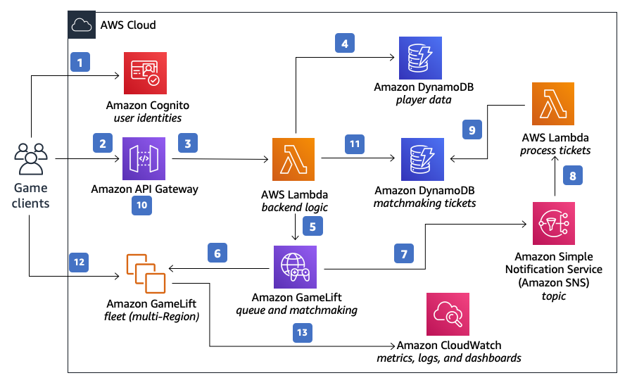
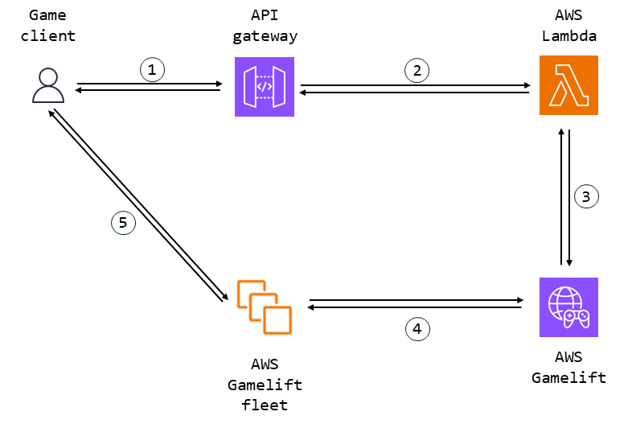

# ガイド：設計

## 設計哲学

オリジナルのプラグインのアイデアは、迅速に動作し、あまり時間をかけずに作成できるものを作ることでした。なぜなら、尊敬すべきプログラマーとして、私は怠け者だからです。

しかし、Unrealに最低限の知識を持つ誰もが使えるツールが欲しかったのです。

そこで、Gameliftの接続（これまでのところ、Gameliftへのリモート接続だけが示されており、直接行うものでした）をUnrealのOnline SubSystemインターフェースを使用して統合し、ローカルソリューション（Gamelift Anywhereや、当時利用可能だった唯一のSDKなど）を利用することにしました。

さらに、READMEに記載されていますが、私の学校プロジェクトではAWSを使用せざるを得ず、クレジットもなかったため、サーバーサイドの開発はすべてローカルで行う必要がありました。これが、ローカルでテスト済みで、サーバー上で再現可能な構成の開発を促進しました（クレジットが得られるときのために）。

それでは、ソリューションのツールを見ていきましょう。

## UnrealのOnline SubSystem

UnrealのOnline SubSystem（OSS）は、Unrealチームがゲームロジックやレプリケーションに依存せず、サーバーバックエンドとの通信のためにプラットフォームに依存しないインターフェースを作成しようとした試みです。

これには、データベースアクセス、ボイスメッセージ、クライアントをサーバーのゲームセッションに接続することなどが含まれます。これが私たちの目的です。

基本的な実装を簡単に見てみましょう：

```cpp
/**
 *	OnlineSubsystem - さまざまなウェブサービス/プラットフォームとの通信をサポートするためのインターフェース群
 */
class ONLINESUBSYSTEM_API IOnlineSubsystem
{
protected:
	/** 意図的に非公開 */
	IOnlineSubsystem() {}

	FOnlineNotificationHandlerPtr OnlineNotificationHandler;
	FOnlineNotificationTransportManagerPtr OnlineNotificationTransportManager;

public:
	
	virtual ~IOnlineSubsystem() {}

    ...

	/** 
	 * 指定されたインターフェースのサブシステムが構成やコマンドラインで有効かどうかを判断します
	 * @param SubsystemName - 要求されたオンラインサービスの名前
	 * @return サブシステムが構成で有効な場合はtrue、それ以外はfalse
	 */
	static bool IsEnabled(const FName& SubsystemName, const FName& InstanceName = NAME_None);

	/**
	 * サブシステムの名前を返します @see OnlineSubsystemNames.h
	 *
	 * @return サブシステムの名前。IOnlineSubsystem::Get() 呼び出しで使用される
	 */
	virtual FName GetSubsystemName() const = 0;

	/**
	 * インスタンス名を取得します。通常は「default」または「none」ですが、「Play In Editor」モードでは、インスタンスを区別します。ほとんどのプラットフォームでは、サードパーティの制約により、1つのマシンのインスタンスに対してのみ接続が許可されているため、これを行うことができません。
	 *
	 * @return このサブシステムのインスタンス名
	 */
	virtual FName GetInstanceName() const = 0;

	/**
	 * コンパイル時にハードウェアに基づいて決定されたローカルオンラインプラットフォームを取得します。
	 * @see OnlineSubsystemNames.h OSS_PLATFORM_NAME_*
	 * @return オンラインプラットフォームの名前の文字列表現
	 */
	static FString GetLocalPlatformName();

	/** @return サブシステムが有効な場合はtrue、それ以外はfalse */
	virtual bool IsEnabled() const = 0;

	/** 
	 * セッション管理サービスにアクセスするためのインターフェースを取得します
	 * @return 適切なセッションサービスのインターフェースポインタ
	 */
	virtual IOnlineSessionPtr GetSessionInterface() const = 0;
	
	/** 
	 * プレイヤーの友達管理サービスにアクセスするためのインターフェースを取得します
	 * @return 適切な友達サービスのインターフェースポインタ
	 */
	virtual IOnlineFriendsPtr GetFriendsInterface() const = 0;

	...
};
```

クラス定義は非常に長いため、一部を省略して短くしました。アイデアはシンプルです：長いクラスに置き換えメソッドがあり、継承とポリモーフィズムを使用して、同じオブジェクトを使用しながら特定のバックエンドを利用するというものです。

以下は、OSS Nullの子クラスの例で、LAN機能を実装しています：

```cpp
/**
 * OnlineSubsystemNull - Null サービス用オンラインサブシステムの実装
 */
class ONLINESUBSYSTEMNULL_API FOnlineSubsystemNull : 
	public FOnlineSubsystemImpl
{

public:

	virtual ~FOnlineSubsystemNull() = default;

	// IOnlineSubsystem

	virtual IOnlineSessionPtr GetSessionInterface() const override;
	virtual IOnlineFriendsPtr GetFriendsInterface() const override;
	virtual IOnlinePartyPtr GetPartyInterface() const override;
	virtual IOnlineGroupsPtr GetGroupsInterface() const override;
	virtual IOnlineSharedCloudPtr GetSharedCloudInterface() const override;
	virtual IOnlineUserCloudPtr GetUserCloudInterface() const override;
	virtual IOnlineEntitlementsPtr GetEntitlementsInterface() const override;
	virtual IOnlineLeaderboardsPtr GetLeaderboardsInterface() const override;
	virtual IOnlineVoicePtr GetVoiceInterface() const override;
	virtual IOnlineExternalUIPtr GetExternalUIInterface() const override;	
	virtual IOnlineTimePtr GetTimeInterface() const override;
	virtual IOnlineIdentityPtr GetIdentityInterface() const override;
	virtual IOnlineTitleFilePtr GetTitleFileInterface() const override;
	virtual IOnlineStoreV2Ptr GetStoreV2Interface() const override;
	virtual IOnlinePurchasePtr GetPurchaseInterface() const override;
	virtual IOnlineEventsPtr GetEventsInterface() const override;
	virtual IOnlineAchievementsPtr GetAchievementsInterface() const override;
	virtual IOnlineSharingPtr GetSharingInterface() const override;
	virtual IOnlineUserPtr GetUserInterface() const override;
	virtual IOnlineMessagePtr GetMessageInterface() const override;
	virtual IOnlinePresencePtr GetPresenceInterface() const override;
	virtual IOnlineChatPtr GetChatInterface() const override;
	virtual IOnlineStatsPtr GetStatsInterface() const override;
	virtual IOnlineTurnBasedPtr GetTurnBasedInterface() const override;
	virtual IOnlineTournamentPtr GetTournamentInterface() const override;
	virtual IMessageSanitizerPtr GetMessageSanitizer(int32 LocalUserNum, FString& OutAuthTypeToExclude) const override;

	virtual bool Init() override;
	virtual bool Shutdown() override;
	virtual FString GetAppId() const override;
	virtual bool Exec(class UWorld* InWorld, const TCHAR* Cmd, FOutputDevice& Ar) override;
	virtual FText GetOnlineServiceName() const override;

	// FTickerObjectBase
	
	virtual bool Tick(float DeltaTime) override;

	// FOnlineSubsystemNull

PACKAGE_SCOPE:

	/** ファクトリのみがインスタンスを作成します */
	FOnlineSubsystemNull() = delete;
	explicit FOnlineSubsystemNull(FName InInstanceName) :
		FOnlineSubsystemImpl(NULL_SUBSYSTEM, InInstanceName),
		SessionInterface(nullptr),
		VoiceInterface(nullptr),
		bVoiceInterfaceInitialized(false),
		LeaderboardsInterface(nullptr),
		IdentityInterface(nullptr),
		AchievementsInterface(nullptr),
		StoreV2Interface(nullptr),
		MessageSanitizerInterface(nullptr),
		OnlineAsyncTaskThreadRunnable(nullptr),
		OnlineAsyncTaskThread(nullptr)
	{}

private:

	/** セッションサービスへのインターフェース */
	FOnlineSessionNullPtr SessionInterface;

	/** ボイス通信用インターフェース */
	mutable IOnlineVoicePtr VoiceInterface;

	/** ボイス通信用インターフェースの初期化フラグ */
	mutable bool bVoiceInterfaceInitialized;

	/** リーダーボードサービスへのインターフェース */
	FOnlineLeaderboardsNullPtr LeaderboardsInterface;

	/** 身元認証用インターフェース */
	FOnlineIdentityNullPtr IdentityInterface;

	/** 実績用インターフェース */
	FOnlineAchievementsNullPtr AchievementsInterface;

	/** ストア用インターフェース */
	FOnlineStoreV2NullPtr StoreV2Interface;

	/** 購入用インターフェース */
	FOnlinePurchaseNullPtr PurchaseInterface;

	/** メッセージのサニタイズ用インターフェース */
	FMessageSanitizerNullPtr MessageSanitizerInterface;

	/** 非同期タスク用のオンラインスレッド */
	class FOnlineAsyncTaskManagerNull* OnlineAsyncTaskThreadRunnable;

	/** 非同期タスクスレッド */
	class FRunnableThread* OnlineAsyncTaskThread;

	// タスクカウンター、各タスクのユニークなスレッド名を生成するために使用
	static FThreadSafeCounter TaskCounter;
};
```

シンプルですね？全てが置き換えられており、クラス内にすべての機能インターフェースが存在します。

多くのプラットフォームには実装があります：Epic Online Services（おそらく機能面では最良）、Steam（重要な要素はほとんど機能しますが、一部の機能にバグあり）、IOS、Android...

では、すべてのプラットフォームに実装があるなら、AWSにも実装があるべきですか？
その答えは「はい」です！Amazon OSSサブシステムがあります、それを見てみましょう。

```cpp
/**
 * アマゾンオンラインサブシステム
 */
class ONLINESUBSYSTEMAMAZON_API FOnlineSubsystemAmazon :
	public FOnlineSubsystemImpl
{
	class FOnlineFactoryAmazon* AmazonFactory;

	/** アイデンティティ認証/認可サービスのインターフェース */
	FOnlineIdentityAmazonPtr IdentityInterface;

	/** 1と0の切り替えに使用される */
	int TickToggle;

PACKAGE_SCOPE:

	/** ファクトリーのみがインスタンスを作成します */
	FOnlineSubsystemAmazon() = delete;
	explicit FOnlineSubsystemAmazon(FName InInstanceName);

public:
	// IOnlineSubsystem

	virtual IOnlineSessionPtr GetSessionInterface() const override { return nullptr; }
	virtual IOnlineFriendsPtr GetFriendsInterface() const override { return nullptr; }
	virtual IOnlinePartyPtr GetPartyInterface() const override { return nullptr; }
	virtual IOnlineGroupsPtr GetGroupsInterface() const override { return nullptr; }
	virtual IOnlineSharedCloudPtr GetSharedCloudInterface() const override { return nullptr; }
	virtual IOnlineUserCloudPtr GetUserCloudInterface() const override { return nullptr; }
	virtual IOnlineLeaderboardsPtr GetLeaderboardsInterface() const override { return nullptr; }
	virtual IOnlineVoicePtr GetVoiceInterface() const override { return nullptr; }
	virtual IOnlineExternalUIPtr GetExternalUIInterface() const override { return nullptr; }
	virtual IOnlineTimePtr GetTimeInterface() const override { return nullptr; }
	virtual IOnlineTitleFilePtr GetTitleFileInterface() const override { return nullptr; }
	virtual IOnlineEntitlementsPtr GetEntitlementsInterface() const override { return nullptr; }
	virtual IOnlineIdentityPtr GetIdentityInterface() const override;
	virtual IOnlineStoreV2Ptr GetStoreV2Interface() const override { return nullptr; }
	virtual IOnlinePurchasePtr GetPurchaseInterface() const override { return nullptr; }
	virtual IOnlineEventsPtr GetEventsInterface() const override { return nullptr; }
	virtual IOnlineAchievementsPtr GetAchievementsInterface() const override { return nullptr; }
	virtual IOnlineSharingPtr GetSharingInterface() const override { return nullptr; }
	virtual IOnlineUserPtr GetUserInterface() const override { return nullptr; }
	virtual IOnlineMessagePtr GetMessageInterface() const override { return nullptr; }
	virtual IOnlinePresencePtr GetPresenceInterface() const override { return nullptr; }
	virtual IOnlineChatPtr GetChatInterface() const override { return nullptr; }
	virtual IOnlineStatsPtr GetStatsInterface() const override { return nullptr; }
	virtual IOnlineTurnBasedPtr GetTurnBasedInterface() const override { return nullptr; }
	virtual IOnlineTournamentPtr GetTournamentInterface() const override { return nullptr; }

	virtual bool Init() override;
	virtual bool Shutdown() override;
	virtual FString GetAppId() const override;
	virtual bool Exec(class UWorld* InWorld, const TCHAR* Cmd, FOutputDevice& Ar) override;
	virtual FText GetOnlineServiceName() const override;
	virtual bool IsEnabled() const override;

	// FTickerBaseObject

	virtual bool Tick(float DeltaTime) override;

	// FOnlineSubsystemAmazon

	/**
	 * デストラクタ
	 */
	virtual ~FOnlineSubsystemAmazon();
};
```

このコードは、アイデンティティインターフェース (`IdentityInterface`) のみを実装しています。
厳しい言い方かもしれませんが、これは完全に何もやくにたたないです。

2016年には、現在は廃止されたOSSの作成が試みられました。
興味があれば、[こちら](https://github.com/gameDNAstudio/AmazonServices)で確認できます。

しかし、なぜこれをもっと有用にしないのでしょうか？ 私には理論があります。
おそらく、AWSの設計哲学はOSSに必要な統合の制限に適合しないのでしょう。

私たちのニーズには、実際にはセッションインターフェース (`SessionInterface`) のみを置き換える必要があります。つまり、アイデンティティインターフェースを単に実装することから大きく外れてはいませんが、機能し、簡単に使えるものが欲しいので、それで十分です。

クライアント側のシステムをよりよく理解したので、サーバー側がどのように見えるかを見てみましょう。

## アマゾンウェブサービス (AWS)

アマゾンウェブサービス (AWS) は、サーバーソリューションおよびサーバー開発ソリューションであり、二つのアーキテクチャ原則に基づいています：[イベント駆動アーキテクチャ](https://aws.amazon.com/event-driven-architecture/) と [インフラストラクチャー・アズ・ア・サービス (IaaS)](https://aws.amazon.com/fr/what-is/iaas/)/[クラウドコンピューティング](https://aws.amazon.com/what-is-cloud-computing/?nc1=h_ls)。

AWSのフレームワークについて詳しく知りたい場合は、[こちら](https://docs.aws.amazon.com/en_us/wellarchitected/2022-03-31/framework/welcome.html)でドキュメントを確認できます（執筆時点でやや古いですが）。

要約すると、AWSは非常に小さなコンポーネントをたくさん持ち、それらの小さなツールをつなげて一つのソリューションを作成するという方式で機能します。

これは、UNIXコミュニティの[「一つのことをやり、それをうまくやる」](https://ja.wikipedia.org/wiki/UNIX%E5%93%B2%E5%AD%A6)という哲学に似ています。

その代表的な例が[ラムダ](https://aws.amazon.com/lambda/)です。

ラムダはどこからでも呼び出せる関数で、実行するためには10行以内のコードである必要があります。ラムダは他のラムダを呼び出すことができ、イベント駆動アーキテクチャのため、コードを実行するサーバーではなく、リクエストがあったときに呼び出されるだけの関数です。

主な利点は、[水平スケーリング](https://en.wikipedia.org/wiki/Database_scalability) の能力にあります。

要約すると、AWSではすべてがサービス（ラムダで関数を実行する場合や、GameLiftでゲームサーバーをホスティングする場合など）であり、自分でサーバーを作成する必要がないため、需要が急増したり減少したりすると、リソースの使用が需要に応じて調整され、使用した分だけ支払うことになります。

これは営業用の言葉ですが、実際には需要に応じた設定が難しく、計算時間が無駄になることがあります。

では、私たちのケースではAWSの利用はどうなっているのでしょうか？

[こちら](https://docs.aws.amazon.com/architecture-diagrams/latest/multiplayer-session-based-game-hosting-on-aws/multiplayer-session-based-game-hosting-on-aws.html)がAWSがサイトに示している内容です。



これはAWSの機能についてのかなり詳細なビューです。
多くの機能があります：ユーザーアカウントの接続、データベース、マッチメイキング、ゲームデータと分析など。

しかし、LAN接続と同様の機能をAWS上で提供したいだけのシンプルなアプリケーションには少し多すぎます。

「不要なもの」を取り除くと、以下のようになります。



ここでは、クライアント以外はすべて「AWS Cloud」にあります。
私たちのソリューションのコンポーネントを一つずつ見ていきましょう。

1. <picture> <source media="(prefers-color-scheme: dark)" srcset="../../Media/Dark/Res_User_48_Dark.svg"> <source media="(prefers-color-scheme: light)" srcset="../../Media/Light/Res_User_48_Light.svg">  </picture> クライアントから  API Gateway との通信

AWSはセキュリティに厳格であるため、私たちのソリューション内のブロック（GameLiftなど）と直接通信することはできません。サーバーを取得するためには、GameLiftにパブリックポートを開放して一時的にクライアントと通信するように要求する必要があります。

AWSとの公開接続の唯一の方法は、[API Gateway](https://aws.amazon.com/api-gateway/) と呼ばれるもので、名前が示す通り、AWS Cloud内のすべてにアクセスするためのゲートウェイです。

API GatewayはREST APIまたはWebSocket APIとしても使用できますが、ここではHTTPリクエストを通じてAWSと通信する手段として使用します。

2.  API Gateway から  Lambda の実行

残念ながら、API Gateway上でイベントを作成してサーバーに必要な設定をすべて行い、必要なデータで応答することはできません。
そのため、関数を作成し、コードで設定する必要があります。
したがって、私たちのソリューションでは、API Gatewayはただ[ラムダ](https://aws.amazon.com/lambda/) を実行するためのものです。ラムダはAWS Cloud内でほぼすべてを実行できる関数です。

ローカルで実行しているためセキュリティの考慮はありませんが、展開するつもりがある場合は、セキュリティの問題にしっかり取り組むべきです。

3.  ラムダが  AWS GameLift と連携

ラムダを実行する際に、AWSが提供するツールを使って、コード内でGameSessionsやPlayerSessionsを作成し、[GameLift](https://aws.amazon.com/gamelift/) のリソースを検索することができます。

これらのリソースはHTTP応答としてフォーマットされ、クライアントに提供されます。

4.  GameLift が fleet 上でインスタンスを初期化 

fleetはGameLift上のリソースで、通常は地域内のサーバーを意味します。

私たちのユースケースでは、これを「自分たち」として定義しています（基本的に「localhost」にリダイレクトします）。まだ行っていない場合は、[プロジェクトの実行方法](../Usage/Run.md)を確認してください。

5.  fleet 上のゲームセッションがクライアントと直接接続 <picture> <source media="(prefers-color-scheme: dark)" srcset="../../Media/Dark/Res_User_48_Dark.svg"> <source media="(prefers-color-scheme: light)" srcset="../../Media/Light/Res_User_48_Light.svg">  </picture>

ゲームセッションに割り当てられた後、クライアントはサーバーのIPアドレスとポートに直接接続します。サーバーは短期間オープンされています。

私たちのケースでは、IPアドレスはlocalhost（または127.0.0.1）であり、これはクライアントのマシン上でサーバーを検索するためにネットワーク接続をリダイレクトします。

これは、同じマシン上のサーバーにクライアントをリダイレクトするための複雑な解決策ですが、AWSでの接続はこのように機能します。
それには良い理由があり、このシステムは世界中の複数のサーバーで機能するように簡単にスケーラブルです。

## 詳細

ソリューションの全体設計をカバーしたので、その機能を深く掘り下げて、プラグインに実装された3つの主要なメソッドを見てみましょう。

- [AWSOSSがAPI GatewayにHTTPリクエストを送信する](AWSOSS.md)
- [セッションを作成する](CreateSession.md)
- [セッションを見つける](FindSession.md)
- [セッションに参加する](JoinSession.md)
