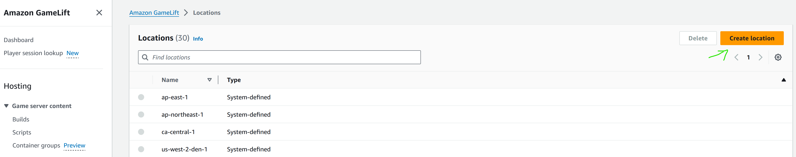
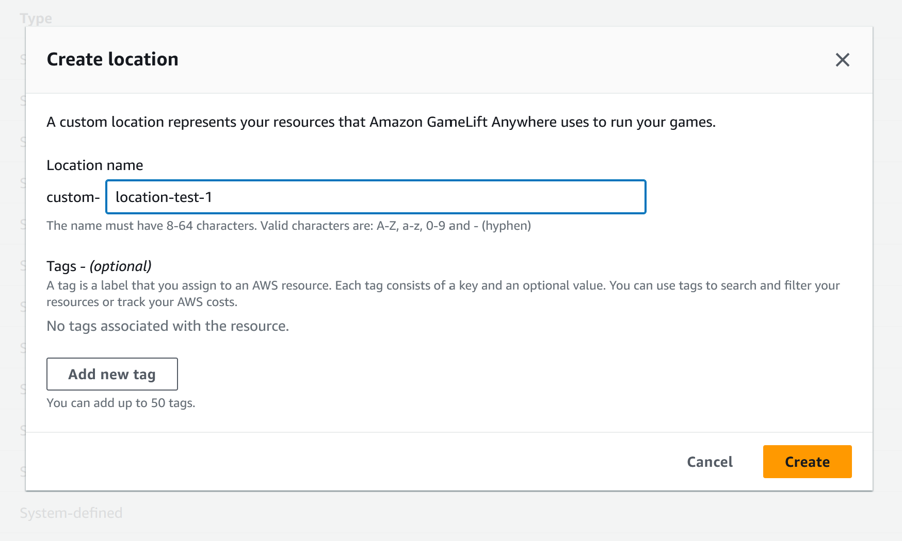
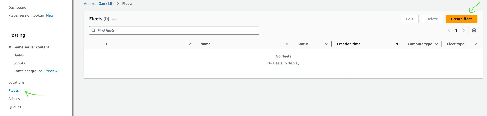
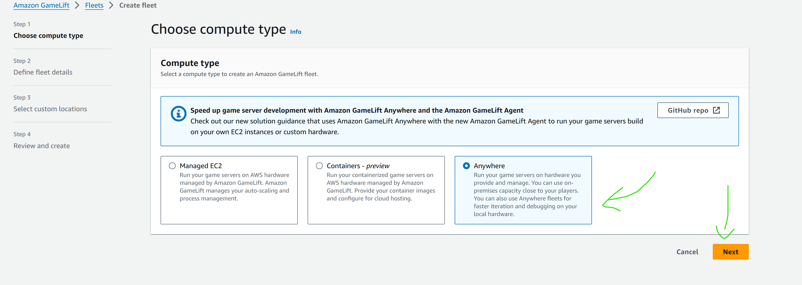
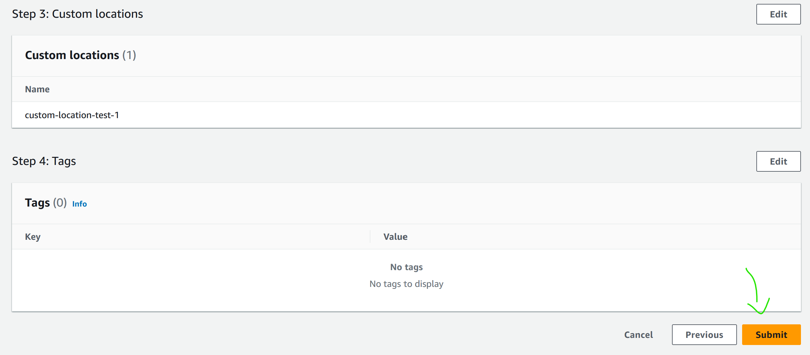
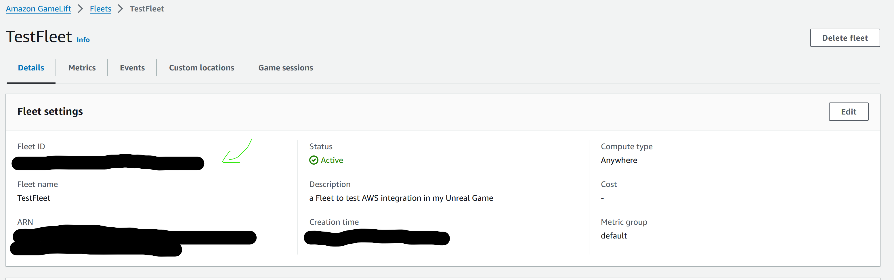
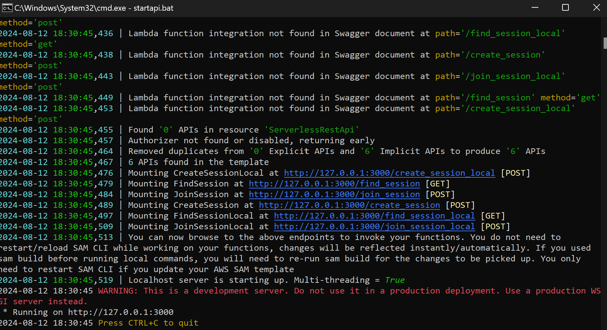
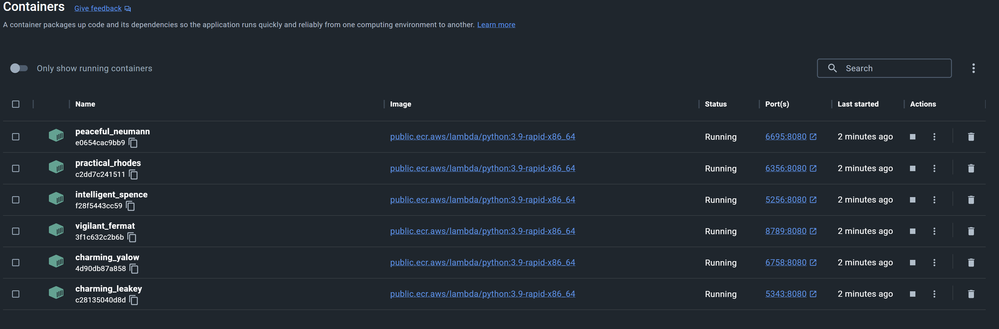

# Run and Test AWS OSS

That you set up your own use of the plugin, time to test it.

To test the gamelift integration, we need multiple thing:

- [the game's server build (that should in the end be on gamelift)](#build-your-games-server-build)
- [our local gamelift](#setting-up-a-local-gamelift)
  - [using old...](#set-up-legacy-local-gamelift)
  - [or new sdk](#set-up-new-sdk-local-gamelift)
- [our local API gateway with AWS SAM](#launch-sam-api-gateway)

let us go through it.

## Build your game's server build

There is numerous tutorial to make a game server build, such as [this one](https://dev.epicgames.com/documentation/en-us/unreal-engine/setting-up-dedicated-servers?application_version=4.27), but we also have a specifc requirement to make it work with the gamelift API.

specifically, as said in [AWS documentation](https://docs.aws.amazon.com/gamelift/latest/developerguide/integration-testing.html#integration-testing-dev), we need to have special code in our Game Instance to make it work.

[Here](../../Source/Private/TestAWSGameInstance.cpp#L53) is an example of said code.

```cpp
//Getting the module first.
	FGameLiftServerSDKModule* gameLiftSdkModule = &FModuleManager::LoadModuleChecked<FGameLiftServerSDKModule>(FName("GameLiftServerSDK"));

	//Define the server parameters for a GameLift Anywhere fleet. These are not needed for a GameLift managed EC2 fleet.
	FServerParameters serverParameters;

	//AuthToken returned from the "aws gamelift get-compute-auth-token" API. Note this will expire and require a new call to the API after 15 minutes.
	if (FParse::Value(FCommandLine::Get(), TEXT("-authtoken="), serverParameters.m_authToken))
	{
		UE_LOG(GameServerLog, Log, TEXT("AUTH_TOKEN: %s"), *serverParameters.m_authToken)
	}

	//The Host/compute-name of the GameLift Anywhere instance.
	if (FParse::Value(FCommandLine::Get(), TEXT("-hostid="), serverParameters.m_hostId))
	{
		UE_LOG(GameServerLog, Log, TEXT("HOST_ID: %s"), *serverParameters.m_hostId)
	}

	//The Anywhere Fleet ID.
	if (FParse::Value(FCommandLine::Get(), TEXT("-fleetid="), serverParameters.m_fleetId))
	{
		UE_LOG(GameServerLog, Log, TEXT("FLEET_ID: %s"), *serverParameters.m_fleetId)
	}

	//The WebSocket URL (GameLiftServiceSdkEndpoint).
	if (FParse::Value(FCommandLine::Get(), TEXT("-websocketurl="), serverParameters.m_webSocketUrl))
	{
		UE_LOG(GameServerLog, Log, TEXT("WEBSOCKET_URL: %s"), *serverParameters.m_webSocketUrl)
	}

	//The PID of the running process
	serverParameters.m_processId = FString::Printf(TEXT("%d"), GetCurrentProcessId());
	UE_LOG(GameServerLog, Log, TEXT("PID: %s"), *serverParameters.m_processId);

	//InitSDK establishes a local connection with GameLift's agent to enable communication.
	UE_LOG(GameServerLog, Log, TEXT("Call InitSDK"))

	FGameLiftGenericOutcome outcome = gameLiftSdkModule->InitSDK(serverParameters);

	if (outcome.IsSuccess())
	{
		UE_LOG(GameServerLog, Log, TEXT("GameLift Server Initialization Successful"));
	}
	else
	{
		FGameLiftError error = outcome.GetError();
		UE_LOG(GameServerLog, Log, TEXT("GameLift Server Initialization Failed: Error %s\n%s"), *error.m_errorName, *error.m_errorMessage);
	}


	//Respond to new game session activation request. GameLift sends activation request 
	//to the game server along with a game session object containing game properties 
	//and other settings. Once the game server is ready to receive player connections, 
	//invoke GameLiftServerAPI.ActivateGameSession()
	auto onGameSession = [=](Aws::GameLift::Server::Model::GameSession gameSession)
	{
		FString gameSessionId = FString(gameSession.GetGameSessionId());
		UE_LOG(GameServerLog, Log, TEXT("GameSession Initializing: %s"), *gameSessionId);
		gameLiftSdkModule->ActivateGameSession();
	};

	FProcessParameters* params = new FProcessParameters();
	params->OnStartGameSession.BindLambda(onGameSession);

	//OnProcessTerminate callback. GameLift invokes this before shutting down the instance 
	//that is hosting this game server to give it time to gracefully shut down on its own. 
	//In this example, we simply tell GameLift we are indeed going to shut down.
	params->OnTerminate.BindLambda([=]() 
	{
		UE_LOG(GameServerLog, Log, TEXT("Game Server Process is terminating"));
		gameLiftSdkModule->ProcessEnding(); 
	});

	//HealthCheck callback. GameLift invokes this callback about every 60 seconds. By default, 
	//GameLift API automatically responds 'true'. A game can optionally perform checks on 
	//dependencies and such and report status based on this info. If no response is received  
	//within 60 seconds, health status is recorded as 'false'. 
	//In this example, we're always healthy!
	params->OnHealthCheck.BindLambda([]() {UE_LOG(GameServerLog, Log, TEXT("Performing Health Check")); return true; });

	//Here, the game server tells GameLift what port it is listening on for incoming player 
	//connections. In this example, the port is hardcoded for simplicity. Since active game
	//that are on the same instance must have unique ports, you may want to assign port values from a range.
	const int32 port = FURL::UrlConfig.DefaultPort;
	params->port = port;

	//Here, the game server tells GameLift what set of files to upload when the game session 
	//ends. GameLift uploads everything specified here for the developers to fetch later.
	TArray<FString> logfiles;
	logfiles.Add(TEXT("aLogFile.txt"));
	params->logParameters = logfiles;

	//Call ProcessReady to tell GameLift this game server is ready to receive game sessions!
	outcome = gameLiftSdkModule->ProcessReady(*params);
	if (outcome.IsSuccess())
	{
		UE_LOG(GameServerLog, Log, TEXT("GameLift Server Initialization Successful"));
	}
	else
	{
		FGameLiftError error = outcome.GetError();
		UE_LOG(GameServerLog, Log, TEXT("GameLift Server Initialization Failed: Error %s\n%s"), *error.m_errorName, *error.m_errorMessage);
	}
```

You may look at the comments and documentation what it does, but in short : this allows for the game server (the server binary I mean) to communicate with gamelift and register itself.

Now you may make your server build by making a server target file (like the one below) and using UE source files.

```cs
// Copyright Epic Games, Inc. All Rights Reserved.

using UnrealBuildTool;
using System.Collections.Generic;

public class TestAWSServerTarget : TargetRules //Change this line according to the name of your project
{
	public TestAWSServerTarget(TargetInfo Target) : base(Target) //Change this line according to the name of your project
	{
		Type = TargetType.Server;
		DefaultBuildSettings = BuildSettingsVersion.V2;
		ExtraModuleNames.Add("TestAWS"); //Change this line according to the name of your project
	}
}
```

You may have problems packaging the game or launching the executable.
Here is a list of problems and some solutions : 
 - Unreal's Automation Tool does not work or Unreal Build Tool won't run :
   
did you compile the Engine? did you compile the associated tools ?

 - The line in the Game Instance will not compile :
   
did you add the GameliftServerSDK plugin in your .uproject and enabled it ? did you add it in your .Build.cs ?

 - The server compiled but it crashes and won't run :
   
Are the OpenSSL libraries and gamelift libraries (dynamic and static libraries) in the packaged server ?

The InitSDK command may fail for now but it won't after setting upthe local gamelift.

## Setting up a Local Gamelift

There is two choices for gamelift tests : legacy and new SDK, the shown Game Instance code was made with new SDK in mind, but should work with legacy.

There is a few differences to set up between both methods :

### Set up legacy local Gamelift

It is the easiest to set up between the both methods, as it is also more limited.

Most of the method is explained in [AWS's Documentation](https://docs.aws.amazon.com/gamelift/latest/developerguide/integration-testing-local.html).

You will need to download Java to run local gamelift, and run it.

Then start the packaged game server, you won't need to give arguments to run the server, it should be able to find gamelift buy itself locally.

If InitSDK fails with the GameInstance code and no arguments, then replace the code with a call to

```cpp
InitSDK(void);
```

If you are using legacy and see that InitSDK succeeded, your packaged server build and the local gamelift are successfully connected.

### Set up new SDK local Gamelift

Setting up the new SDK's local gamelift is much more complicated as it relies on Gamelift Anywhere, wich can actually work in production.
It then requires a similar amount of work to set up to something that could be in production.

It is fairly well explained and described in [AWS's Documentation](https://docs.aws.amazon.com/gamelift/latest/developerguide/integration-testing.html), but we'll go through it together.

it uses [AWS-CLI](https://aws.amazon.com/cli/) so if you did not install it before, please do it beforehand.

First, [you need to create a location](https://docs.aws.amazon.com/gamelift/latest/developerguide/fleets-creating-anywhere.html#fleet-anywhere-location).
For this we'll use te AWS Console, in Gamelift section.
Make sure you are in the right location when you do this (as Gamelift anywhere can redirect everywhere, but the public server taht redirects can only be in some locations)

- Click on "Create Location"



- Give your location a name the click on "Create"



You have now created your custom location.

Then we'll [create a fleet](https://docs.aws.amazon.com/gamelift/latest/developerguide/fleets-creating-anywhere.html#fleet-anywhere-create) associated with the location.

- Go to the Fleet page and click on "Create"



- Choose "Anywhere" then click on "Next"



- Give a name to your fleet then click on "Next"


- Choose your newly created location then click on "Next"


- Click on "Submit" at the bottom of the page



You have now created a fleet to connect to.



We need to now [register our local machine](https://docs.aws.amazon.com/gamelift/latest/developerguide/fleets-creating-anywhere.html#fleet-anywhere-compute) as being a part of this fleet.


```sh
aws gamelift register-compute \
    --compute-name TestAWSCompute \
    --fleet-id  fleet-[the fleet id you got from the previous step]\
    --ip-address 127.0.0.1 \
    --location custom-location-test-1 
```

You will need the fleet-id of the fleet you created, that can be found in the page above to associate it.

You can also, if you want to, choose to use your public ip and do port forwarding on your Network Address Translator (NAT) and firewall, if you want this test server to be accessible to the worldwide internet.

Now that your "compute" is registered, erverything is set up to actually use and run the server.

Ecery time you will want to run a server with this new SDK, you will need tyo ask for an authentification key, for security purposes.

The command looks like that :

```sh
aws gamelift get-compute-auth-token \
 --fleet-id fleet-[the fleet id you got from the previous step]\
 --compute-name TestAWSCompute
```

You will get back an authentification token (AuthToken) that is necessary to run the server.

Then you can run the server executable, and give it all the necessary arguments for it to properly InitSDK.

here is a windows bat script to launch the executable with the right arguments.

```bat
set SERVER_EXE_PATH="[The path to your server executable]"
set FLEET_ID="[The fleet id you got previously]"
set AUTH_ID="[The AuthToken from the previous step]"
set HOST_ID="TestAWSCompute"
set WEB_SOCKET="[your gamelift socket location here, it should look something like this : wss://ap-[chosen region].api.amazongamelift.com]"
set PORT="[a port to listen to, ot your liking, UE sets it to 7777]"

%SERVER_EXE_PATH%\[Your server executable name].exe -authtoken=%AUTH_ID% -fleetid=%FLEET_ID% -hostid=%HOST_ID% -websocketurl=%WEB_SOCKET% -port=%PORT% -log
```

Make sure that InitSDK succeeds, otherwise you will not be able to test.

If it succeeds, you have a working server !

## Launch SAM API Gateway

Now, that we set up server to gamelift connection, we need to set up client to gamelift connection.

For this we need to launch the AWS-SAM template.

This is pretty much plug-and-play, if you've already configured your project.

If not, see the [Installation Guide](../Install/Prerequisites.md).

First, launch up Docker, as SAM uses it to create a framework similar from what is on AWS's server.

Then launch AWS-SAM.

I left a [bat script](../../Plugins/AWSOSS/SAM/startapi.bat) to launch SAM quickly. It looks like this :

```bat
sam local start-api --container-host-interface 0.0.0.0 --debug
```

It launches sam on the local host, by creating container on docker.

Don't forget to build the lambda's image beforehand with sam build command.

Once it is properly launched, it should look like this in command line and in Docker:




We have now then client to gamelift connection up and running !

This mean you can now test your gamelift integration !

Have fun !
