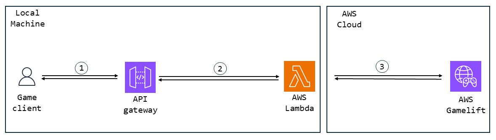
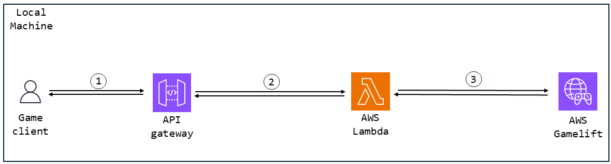

# Find Session

After creating a session, we need other users to be able to join the game session.
Let see how we can list up the created game sessions for our user to choose and join in.

## Table of contents

- [Find Session](#find-session)
  - [Table of contents](#table-of-contents)

## The solution's architecture

The solution attempts to replicate what teh LAN implemenation feels like.
So the actual solution is just about gathering the information on created game session as SessionSearch in the OSS, and leave actual implementation for the user.
So all we need is to get back the game session's data

This means the architecture is fairly similar to the one to create game session, the only difference being that there is connection involved.

### Gamelift Anywhere Architecture



The back and forth is done through the same method as explained in the [create session section](CreateSession.md#gamelift-anywhere-architecture). That is:

1. <picture> <source media="(prefers-color-scheme: dark)" srcset="../Media/Dark/Res_User_48_Dark.svg"> <source media="(prefers-color-scheme: light)" srcset="../Media/Light/Res_User_48_Light.svg">  </picture> client and  API Gateway's back and forth is done through http requests between the OSS (using the URL's to point to SAM's API Gateway).

2.  SAM API Gateway will use Docker to initialize its  Lambdas and execute them

3.  Lambdas accessing  AWS Gamelift using the credentials in the AWS CLI

### Legacy Gamelift Architecture



Once again, it is the same method as explained in the [create session section](CreateSession.md#legacy-gamelift-architecture). That is:

1. <picture> <source media="(prefers-color-scheme: dark)" srcset="../Media/Dark/Res_User_48_Dark.svg"> <source media="(prefers-color-scheme: light)" srcset="../Media/Light/Res_User_48_Light.svg">  </picture> client and  API Gateway's back and forth is done through http requests between the OSS (using the URL's to point to SAM's API Gateway).

2.  SAM API Gateway will use Docker to initialize its  Lambdas and execute them

3.  Lambdas accessing  AWS Gamelift by directly pointing to the port on the machine where the legacy gamelift is ran

## Find Session Request method

To access the game session's information on gamelift we need to find an http request to call a lambda.

The request method will be very similar to the one we've seen to start a session, as the logic is quite the same.

[Here](../../Plugins/AWSOSS/Source/AWSOSS/Private/OnlineSessionInterfaceAWS.cpp#L487) is the method.

```cpp
bool FOnlineSessionAWS::FindSessions(int32 SearchingPlayerNum, const TSharedRef<FOnlineSessionSearch>& SearchSettings)
{
	uint32 Return = ONLINE_FAIL;

	if (SearchSettings->bIsLanQuery)
	{
		Return = AWSSubsystem->GetLANSessionInterface()->FindSessions(SearchingPlayerNum, SearchSettings) ? ONLINE_SUCCESS : Return;
	}// Don't start another search while one is in progress
	else if (!CurrentSessionSearch.IsValid() && SearchSettings->SearchState != EOnlineAsyncTaskState::InProgress)
	{
		// Free up previous results
		SearchSettings->SearchResults.Empty();

		// Copy the search pointer so we can keep it around
		CurrentSessionSearch = SearchSettings;

		// remember the time at which we started search, as this will be used for a "good enough" ping estimation
		SessionSearchStartInSeconds = FPlatformTime::Seconds();

		// reseting the timeout timer
		FindSessionRequestTimer = 0.0f;

		Return = ONLINE_IO_PENDING;

		if (Return == ONLINE_IO_PENDING)
		{
			SearchSettings->SearchState = EOnlineAsyncTaskState::InProgress;

			IAWSHttpRequest FindSessionRequest = AWSSubsystem->MakeRequest(FindSessionURI, TEXT("GET"));
			FindSessionRequest->OnProcessRequestComplete().BindRaw(this, &FOnlineSessionAWS::OnFindSessionsResponseReceived);
			FindSessionRequest->ProcessRequest();

		}
	}
	else
	{
		UE_LOG_ONLINE_UC(Warning, TEXT("Ignoring game search request while one is pending"));
		Return = ONLINE_IO_PENDING;
	}


	return Return == ONLINE_SUCCESS || Return == ONLINE_IO_PENDING;
}
```

The only differences between the [start session method](CreateSession.md#start-session-request-method), is that it is a GET request, not a POST, as we do not change the server and just requests for data, and that we use the FindSessionURI.

Otherwise it is pretty much the same.

## Find Sessions Lambda

Similar to the [create sessions' lambda](CreateSession.md#create-session-lambda), there is two version of this lambda, the [anywhere sdk](#find-sessions-anywhere-sdk) version and the [legacy sdk](#find-sessions-legacy-sdk) version.

### Find Sessions Anywhere SDK

Compared to the create sessions lambda, the find sesssions lambda is actually fairly short, as it only needs to request for data from gamelift and give an http response with it.

[Here](../../Plugins/AWSOSS/SAM/find_session/app.py) is the function

```py
def lambda_handler(event, context):
	
	print("in find_session")

	# the final response of this request
	response = {}
	
	# the fleet id that we'll create our game session in
	my_fleet_id = get_my_fleet_id(response)
	
	# error on getting the fleet id, give up and send error response
	if response:
		return response
		
	print("get fleet id succeeded: ", my_fleet_id, "now searching for game sessions")

	location = game_lift.list_compute(FleetId = my_fleet_id)["ComputeList"][0]["Location"]

	print("get location result: ", location)

	# what we're trying to do bnelow is what should be done to preserve resource, but on local gamelift (SDK 4 or earlier at least), search game_session does not work.
	
	# trying to find an existing game session in our fleet
	game_sessions = game_lift.search_game_sessions(FleetId = my_fleet_id, Location = location, FilterExpression = "hasAvailablePlayerSessions=true")

	print("game session found: ", game_sessions.__str__(), " sending them as-is")
		
	# this is a simple GET request, we just need to show to the client what is runnning for the moment.
	# we'll then just sennd this raw answer
	return {
		"statusCode": 200,
		"body" : json.dumps(game_sessions["GameSessions"], default = raw_converter).encode("UTF-8")
		}
```

Most function we already saw in the [create session lambda](CreateSession.md#create-session-anywhere-sdk), which you can refer yourself to if there is something that is misunderstood.

The only method used to get the currently running game sessions is [search_game_sessions](https://boto3.amazonaws.com/v1/documentation/api/latest/reference/services/gamelift/client/search_game_sessions.html).

There is a few functions you can use to get back this data, but the advantage of search_game_sessions, is that it can filter out game sessions depending on parameters.
It is outside our scope, but you could replace the request to a POST request and give data to filter out wanted game sessions out of the active ones.
The only filter expression used here to picture this feature is the fact we will only respond with game sessions that are yet to be full (simply put, with player sessions yet to be created).

This is also the only difference with the legacy SDK

### Find Sessions Legacy SDK

[Here](../../Plugins/AWSOSS/SAM/find_session_local/app.py) is the function of the legacy SDK

```py
def lambda_handler(event, context):
	
	print("in find_session")

	# the final response of this request
	response = {}
	
	# the fleet id that we'll create our game session in.
	# in local Gamelift (SDK4.0), it actually does not matter, as long as we have the same throughout.
	my_fleet_id = global_fleet_id
	
	# error on getting the fleet id, give up and send error response
	if response:
		return response
		
	print("get fleet id succeeded: ", my_fleet_id, "now searching for game sessions")
	
	# trying to find an existing game session in our fleet
	# search session does not exist in gamelift local, so we'll use describe game_sessions
	# note that we don't have a filter. this is one problem with this implementation, but it is too small of an environment to really matter.
	game_sessions = game_lift.describe_game_sessions(FleetId = my_fleet_id)

	print("game session found: ", game_sessions.__str__(), " sending them as-is")
		
	# this is a simple GET request, we just need to show to the client what is runnning for the moment.
	# we'll then just sennd this raw answer
	return {
		"statusCode": 200,
		"body" : json.dumps(game_sessions["GameSessions"], default = raw_converter).encode("UTF-8")
		}
```

Once again fairly similar to the implementation of [create game session lambda in the legacy sdk](CreateSession.md#create-session-legacy-sdk), but with just one different call.

So why don't we use the same "search_game_session" to get our game sessions data with a filter ?
Simple answer, because we cannot.

It is written in [AWS' own documentation](https://docs.aws.amazon.com/gamelift/latest/developerguide/integration-testing-local.html) but Gamelift local legacy SDK only supports few APIs:

- CreateGameSession
- CreatePlayerSession
- CreatePlayerSessions
- DescribeGameSessions
- DescribePlayerSessions

So we actually do not have the choice of what function to use to get the information on avaiblable and active game sessions.

Now that the request gives us data about game session, let's handle the response.

## Find Sessions Response Method

[Here](../../Plugins/AWSOSS/Source/AWSOSS/Private/OnlineSessionInterfaceAWS.cpp#L531) is the method.

```cpp
void FOnlineSessionAWS::OnFindSessionsResponseReceived(FHttpRequestPtr Request, FHttpResponsePtr Response, bool bConnectedSuccessfully)
{
	ProcessHttpRequest();
	
	/** this can happen in two case: 
	* - a response of a previous request came after being timed out, we still ignore it as we considered it failed
	* - a response of this request came after timeing out, same case we ignore it. */
	if (CurrentSessionSearch->SearchState != EOnlineAsyncTaskState::InProgress)
		return;

	//We got back sessions without errors so we consider we're ok with the result
	//if there is no game session, it is actually a plausible conclusion, there is just no one with a game session right now
	Result = ONLINE_SUCCESS;

	//compute our ping approximate, at least better than nothing
	int32 VeryBadPingApproximate = FPlatformTime::Seconds() - SessionSearchStartInSeconds;

	TArray<TSharedPtr<FJsonValue>> GameSessions = response->AsArray();
	for (int32 i = 0; i < GameSessions.Num(); i++)
	{
		//Getting the game sessions as object for easier time getting the data we want
		TSharedPtr<FJsonObject> GameSession = GameSessions[i]->AsObject();

		//The struct used to fill our AWS game session data
		FOnlineSessionSearchResult SearchResult;

		SearchResult.PingInMs = VeryBadPingApproximate;

		// we did not implement private or public game sessions for the moment, so we'll just fill both for both to work the same
		{
			// max player sessions fill
			SearchResult.Session.SessionSettings.NumPublicConnections = GameSession->GetNumberField(TEXT("MaximumPlayerSessionCount"));
			SearchResult.Session.SessionSettings.NumPrivateConnections = SearchResult.Session.SessionSettings.NumPublicConnections;

			//currently available player sessions
			SearchResult.Session.NumOpenPublicConnections = SearchResult.Session.SessionSettings.NumPublicConnections - GameSession->GetNumberField(TEXT("CurrentPlayerSessionCount"));
			SearchResult.Session.NumOpenPrivateConnections = SearchResult.Session.NumOpenPublicConnections;
		}

		//Set the user friendly name, chosen by the game session's owner
		SearchResult.Session.SessionSettings.Set(TEXT("Name"), GameSession->GetStringField("Name"));
		//Set the Game Session Id, in case user will want to join this session (this should bne opaque to user and nerver be seen, but we still need to save it somewhere)
		SearchResult.Session.SessionSettings.Set(TEXT("GameSessionId"), GameSession->GetStringField("GameSessionId"));

		CurrentSessionSearch->SearchResults.Add(SearchResult);
	}
	
	CurrentSessionSearch->SearchState = EOnlineAsyncTaskState::Done;
	TriggerOnFindSessionsCompleteDelegates((Result == ONLINE_SUCCESS) ? true : false);
}
```

Let's go through it.

First, we make sure the response is valid, and that the response is not too late.

```cpp
void FOnlineSessionAWS::OnFindSessionsResponseReceived(FHttpRequestPtr Request, FHttpResponsePtr Response, bool bConnectedSuccessfully)
{
	ProcessHttpRequest();
	
	/** this can happen in two case: 
	* - a response of a previous request came after being timed out, we still ignore it as we considered it failed
	* - a response of this request came after timeing out, same case we ignore it. */
	if (CurrentSessionSearch->SearchState != EOnlineAsyncTaskState::InProgress)
		return;
```

Then, we loop through the number of game sessions the response gave us and create a SessionSearchResult object (wchich is an OSS object), for each one.

```cpp
//compute our ping approximate, at least better than nothing
	int32 VeryBadPingApproximate = FPlatformTime::Seconds() - SessionSearchStartInSeconds;

	TArray<TSharedPtr<FJsonValue>> GameSessions = response->AsArray();
	for (int32 i = 0; i < GameSessions.Num(); i++)
	{
		//Getting the game sessions as object for easier time getting the data we want
		TSharedPtr<FJsonObject> GameSession = GameSessions[i]->AsObject();

		//The struct used to fill our AWS game session data
		FOnlineSessionSearchResult SearchResult;

		SearchResult.PingInMs = VeryBadPingApproximate;
```

Then we add the proper data to the search results, which are:

- Max Player Number
- Current Player Number
- Session's Name
- Game Session's Id

```cpp
		// we did not implement private or public game sessions for the moment, so we'll just fill both for both to work the same
		{
			// max player sessions fill
			SearchResult.Session.SessionSettings.NumPublicConnections = GameSession->GetNumberField(TEXT("MaximumPlayerSessionCount"));
			SearchResult.Session.SessionSettings.NumPrivateConnections = SearchResult.Session.SessionSettings.NumPublicConnections;

			//currently available player sessions
			SearchResult.Session.NumOpenPublicConnections = SearchResult.Session.SessionSettings.NumPublicConnections - GameSession->GetNumberField(TEXT("CurrentPlayerSessionCount"));
			SearchResult.Session.NumOpenPrivateConnections = SearchResult.Session.NumOpenPublicConnections;
		}

		//Set the user friendly name, chosen by the game session's owner
		SearchResult.Session.SessionSettings.Set(TEXT("Name"), GameSession->GetStringField("Name"));
		//Set the Game Session Id, in case user will want to join this session (this should bne opaque to user and nerver be seen, but we still need to save it somewhere)
		SearchResult.Session.SessionSettings.Set(TEXT("GameSessionId"), GameSession->GetStringField("GameSessionId"));

		CurrentSessionSearch->SearchResults.Add(SearchResult);
	}
	
	CurrentSessionSearch->SearchState = EOnlineAsyncTaskState::Done;
	TriggerOnFindSessionsCompleteDelegates((Result == ONLINE_SUCCESS) ? true : false);
```

Remember that what you put in the SearchResults are at your own discretion, and that this is basic implementation, you may want to have more thing for you to do thing like sort the list of game session for user.

It calls the callback at the end for the Search Results to be used somewhere.

Expected use would to make a session menu by listing game session to allow user to choose its own menu.

> [!WARNING]
> It may seem counter intuitive, but while I have tested this solution and it worked, I could not test that find sessions worked with multiple sessions, so there may be a problem.
> [!NOTE]
> This is very much out of the scope, but it may be preferable to not send *all data* about your game sessions to your client, as it could be used maliciously.
> You should only send what you need.

Now that user can choose a game session amongst the ones that are up, let's see how to allow him to [join a game session](JoinSession.md).
